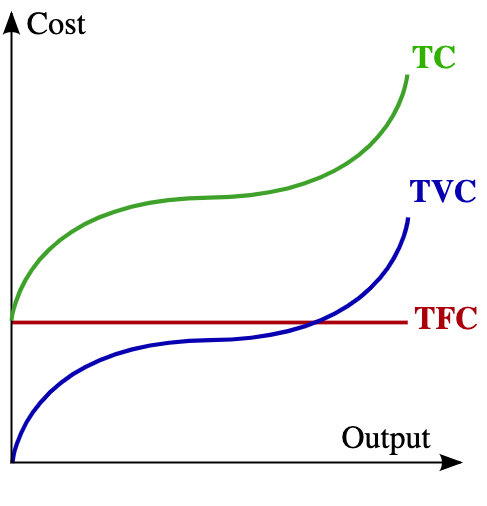
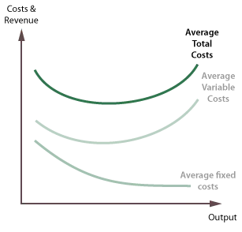
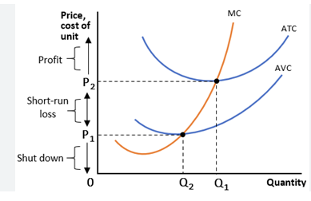
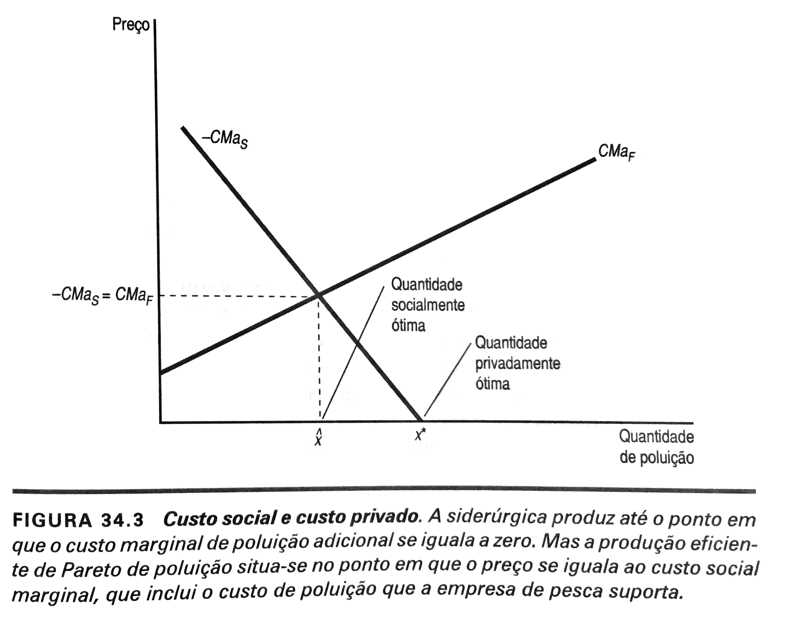
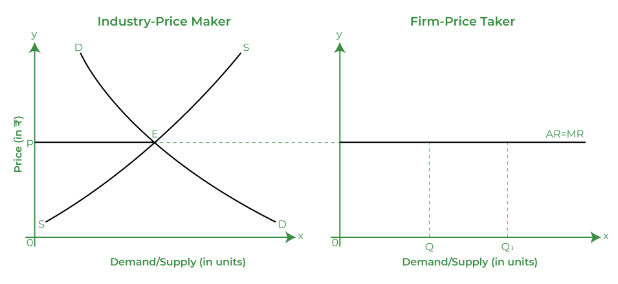
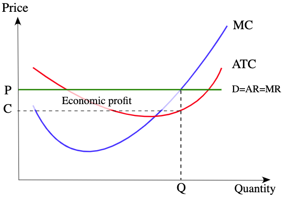
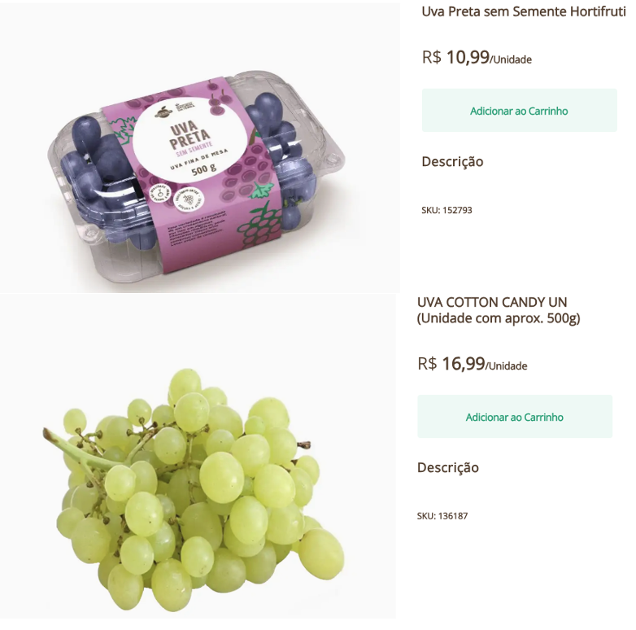
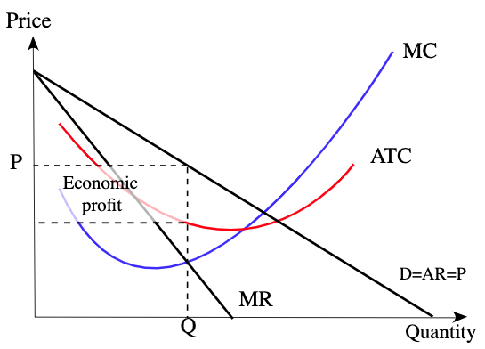

class: center

```{r setup, include=FALSE}
# Dependências dos slides/aula
library(knitr)          # CRAN v1.33
library(rmarkdown)      # CRAN v2.10
library(xaringan)       # CRAN v0.22
library(xaringanthemer) # CRAN v0.3.0
library(xaringanExtra)  # [github::gadenbuie/xaringanExtra] v0.5.5
library(RefManageR)     # CRAN v1.3.0
library(ggplot2)        # CRAN v3.3.5
library(fontawesome)    # [github::rstudio/fontawesome] v0.1.0
library(pagedown)
library(scales)
library(plotly)
library(dplyr)
library(reshape2)
library(readxl)

# Opções de chunks
options(htmltools.dir.version = FALSE)
knitr::opts_chunk$set(
  echo       = FALSE,
  warning    = FALSE,
  message    = FALSE,
  fig.retina = 3,
  fig.width  = 10,
  fig.asp    = 0.6,
  out.width  = "80%",
  fig.align  = "center",
  comment    = "#"
  )

# Cores para gráficos
colors <- c(
  blue       = "#282f6b",
  red        = "#b22200",
  yellow     = "#eace3f",
  green      = "#224f20",
  purple     = "#5f487c",
  orange     = "#b35c1e",
  turquoise  = "#419391",
  green_two  = "#839c56",
  light_blue = "#3b89bc",
  gray       = "#666666"
  )
```

```{r xaringan, echo=FALSE}
# Tema da apresentação
xaringanthemer::style_mono_light(
  base_color                      = unname(colors["blue"]),
  title_slide_background_image    = params$logo_slides, 
  title_slide_background_size     = 12,
  title_slide_background_position = "bottom 10px right 20px",
  title_slide_background_color    = "white",
  title_slide_text_color          = unname(colors["blue"]),
  footnote_position_bottom        = "15px"
  )

# Opções extras do tema
xaringanExtra::use_progress_bar(
  color    = colors["blue"], 
  location = "bottom"
  )
xaringanExtra::use_extra_styles(
  hover_code_line         = TRUE,
  mute_unhighlighted_code = FALSE
  )
xaringanExtra::use_panelset()
```

```{css, echo=FALSE}
pre {
  white-space: pre-wrap;
  overflow-y: scroll !important;
  max-height: 45vh !important;
  overflow-x: auto;
  max-width: 100%;
}
```

```{r load_refs, echo=FALSE, eval=params$references}
# Configuração de citações
RefManageR::BibOptions(
  check.entries = FALSE,
  bib.style     = "authoryear",
  cite.style    = "authoryear",
  style         = "markdown",
  hyperlink     = FALSE,
  dashed        = FALSE
  )
if(params$references){
  temp_refbib <- tempdir()
  download.file(
    url      = params$references_path, 
    destfile = paste0(temp_refbib, "/references.bib"), 
    mode     = "wb"
    )
  myBib <- RefManageR::ReadBib(paste0(temp_refbib, "/references.bib"), check = FALSE)
  }

# Como citar?
# RefManageR::TextCite(myBib, "id_da_citacao")
```

```{r utils, echo=FALSE}
# Função que pega um arquivo .Rmd, condicionalmente o renderiza, 
# e embute o conteúdo do mesmo formatado como Markdown puro 
# no output do documento atual
print_rmd <- function(file, encoding = "UTF-8", render = TRUE){
  if(render){rmarkdown::render(input = file, quiet = TRUE)}
  rmd <- readLines(con = file, encoding = encoding)
  cat("```md\n")
  cat(rmd, sep = "\n")
  cat("```\n")
}
```


### OBJETIVO DA DISCUSSÃO

**Mostrar a importância de se conhecer os custos de produção, reduzir os custos quando possível, para aumentar a competitividade e garantir a rentabilidade do negócio.**

**Debater as estruturas de mercado existentes que afetam o agronegócio.**

```{r, echo=FALSE, out.width="58%"}
knitr::include_graphics("https://media.giphy.com/media/ZtyirT4Pgd4hpggRUP/giphy.gif")
```

---
class: center, middle
### CUSTOS DE PRODUÇÃO

.pull-left[
- Custo é uma **questão contábil**: envolve o dispêndio monetário. 

- É onde se detalha o quanto se gastou com salários, com embalagem, com adubos, água de irrigação, energia, transporte, combustível, manutenções diversas, pagamento de consultorias, aquisição de máquinas, tarifas bancárias, impostos, royalties, investimentos em construções, etc. 

- Algumas publicações dividem os custos contábeis em: a) Pessoas; b) Custo de mecanização; c) Condução da lavoura; d) Colheita e pós-colheita; e) Outros gastos; f) Uso da terra e juros de custeio; g) Inventário (patrimonio) considerando a depreciação.
]

.pull-right[

- Então os dados são organizados de forma a se ter o COE (Custo Operacional Efetivo - A + B + C + D + E);

- O COT (Custo Operacional Total) que é o COE + G + Pró labore;

- E o CT (Custo Total): COT + Remuneração Capital + Remuneração Terra + Remuneração Bens de Capital

- Com os custos calculados e a Receita Total (preços x quantidade) se pode calcular as margens e a rentabilidade do negócio. 

- Cada empresário rural/ produtor tem seu custo, sua receita, suas margens e sua rentabilidade, apesar de existir sempre algo "médio" para balizar. 
]

---
class: center, middle
### CUSTOS DE PRODUÇÃO

.pull-left[
- Os economistas trabalham com curvas de custo. 

- **Custo Variável Total**: parte do custo que varia com a produção. $CVT= f(Y)$

- **Custo Fixo Total**: parte do custo que independe da produção. Ele existe mesmo com $Y=0$

- **Custo Total** é a soma dos custos. $CT=CVT + CFT$

- A curva de **Custo Total** começa no **Custo Fixo Total** e é cúbica. A partir de um certo nível, o produto atinge o seu máximo e apenas os custos aumentam. 
]

.pull-right[

```{r, echo=FALSE, out.width="90%"}

``` 
]

---
class: center, middle
### CUSTOS DE PRODUÇÃO

.pull-left[

```{r, echo=FALSE, out.width="90%"}
knitr::include_graphics("https://media.giphy.com/media/3o8doUeyrZAinxcGBi/giphy.gif")
``` 
]

.pull-right[
- É neste ponto que se têm as ineficiências, quando se está "jogando dinheiro fora", quando é possível manter o mesmo nível de produção reduzindo os custos; 

- E ineficiência é relacionada com baixa competitividade. Quando mais ineficiente, menos competitivo. Quando menos competitivo, maior a chance de sair do mercado. 

- Assim, é necessário observar o quanto se vai produzir e com qual custo de produção. Atingir um ponto de máxima produção pode exigir um nível muito elevado de custos. O foco deve ser maximizar o lucro e não necessariamente a produção. 
]

---
class: center, middle
### CUSTOS DE PRODUÇÃO

.pull-left[

- Em geral, além dos custos totais é normal se calcular os custos médios ou os custos por hectare. 

- O **Custo Médio** ou **Custo Unitário** é dado por $CMe = CT/Y$. 

- $CMe = CVMe + CFMe$

- E o **Custo Médio/Unitário** é o custo mais observado pelo empresário. Quanto custa produzir um quilo de manga Tommy? Quanto custa produzir um quilo de manga Kent? Quanto custa produzir um quilo de BRS Vitória? Quanto custa produzir um quilo de Arra-15?

- A curva de CMe é uma quadrática.
]

.pull-right[
```{r, echo=FALSE, out.width="95%"}

``` 
]

---
class: center, middle
### CUSTOS DE PRODUÇÃO

.pull-left[

- Em um ambiente de alta competitividade, considerando a necessidade de ser intensivo em tecnologia, como é a fruticultura do Vale do São Francisco, não é possível (viável) produzir com a mesma produtividade mundial ou nacional. As contas não fechariam.

- Assim, a busca por aumento de produtividade visa reduzir o CMe, ou seja, ter custos unitários menores, chegar no ponto de mínimo da curva de CMe. 

- A Oferta vai depender de que o preço pago pelo produto seja maior do que o seu custo unitário/custo médio. 
]

.pull-right[
- A oferta continua existindo enquanto os preços pagarem os custos fixos e pelo menos uma parte dos custos variáveis. A oferta para de existir quando os preços não pagarem os custos variáveis. 

```{r, echo=FALSE, out.width="105%"}

``` 
]

---
class: center
### EVOLUÇÃO DA PRODUTIVIDADE MANGA PAM/IBGE

```{r upe1, out.width  = "100%", fig.align  = "center"}
setwd('/Users/jricardofl/Dropbox/Embrapa/2023/UPE Agro 4.0/2023/aula2/dados')

mycolor1 <- c("darkgreen", "orange", "lightblue3")

#Inicio do Script
#Entrando dados no R
dados1 <- read_excel('produt_manga.xlsx', col_names = TRUE)
dados1[,1] <- seq(2001, 2021, by = 1)

#melt data frame into long format
dados1m <- melt(dados1,  id.vars = 'Ano', variable.name = 'regioes')

g1 <- ggplot(data=dados1m, aes(x=Ano, y=value/1000)) +  #estetica vai valer para todos os geom's
    geom_col(aes(fill=regioes), lwd=1, position = "dodge")+
  scale_fill_manual(values=mycolor1)+
  labs(y= "Toneladas por hectare", x= "Anos", title='Evolução da Produtividade da Manga entre 2001 e 2021',
       caption = "") +
  scale_y_continuous(limits=c(0, 35), n.breaks = 10, expand = expansion(add=c(0,0.5)))+
  scale_x_continuous(breaks = seq(2001, 2021, by = 1))+
  theme_classic()+ #Definindo tema
  theme(axis.text.x=element_text(angle=0, hjust=0.5, size=8, margin = margin(b=10)),
        axis.text.y=element_text(hjust=1, size=8, margin = margin(l=20)),
        axis.title.x = element_text(size=8, face = "bold", margin = margin(b=10)),
        axis.title.y = element_text(size=8, face = "bold", margin = margin(l=20)),
        plot.title = element_text(hjust = 0.5, size=12),
        plot.caption = element_text(hjust = 0, size=12),
        legend.position = "bottom", legend.title = element_blank(),
        legend.text=element_text(size=9)) # Definindo posição da legenda

ggplotly(g1) %>%
  layout(legend = list(
                      orientation = "h", 
                      x=0.4, 
                      y=-0.2,
                      title=''))

```

---
class: center
### EVOLUÇÃO DA PRODUTIVIDADE VITICULTURA PAM/IBGE

```{r upe2, out.width  = "100%", fig.align  = "center"}
setwd('/Users/jricardofl/Dropbox/Embrapa/2023/UPE Agro 4.0/2023/aula2/dados')

mycolor1 <- c("purple", "orange", "lightblue3")

#Inicio do Script
#Entrando dados no R
dados1 <- read_excel('produt_uva.xlsx', col_names = TRUE)
dados1[,1] <- seq(2001, 2021, by = 1)

#melt data frame into long format
dados1m <- melt(dados1,  id.vars = 'Ano', variable.name = 'regioes')

g2 <- ggplot(data=dados1m, aes(x=Ano, y=value/1000)) +  #estetica vai valer para todos os geom's
    geom_col(aes(fill=regioes), lwd=1, position = "dodge")+
  scale_fill_manual(values=mycolor1)+
  labs(y= "Toneladas por hectare", x= "Anos", title='Evolução da Produtividade da Uva entre 2001 e 2021',
       caption = "") +
  scale_y_continuous(limits=c(0, 50), n.breaks = 10, expand = expansion(add=c(0,0.5)))+
  scale_x_continuous(breaks = seq(2001, 2021, by = 1))+
  theme_classic()+ #Definindo tema
  theme(axis.text.x=element_text(angle=0, hjust=0.5, size=8, margin = margin(b=10)),
        axis.text.y=element_text(hjust=1, size=8, margin = margin(l=20)),
        axis.title.x = element_text(size=8, face = "bold", margin = margin(b=10)),
        axis.title.y = element_text(size=8, face = "bold", margin = margin(l=20)),
        plot.title = element_text(hjust = 0.5, size=12),
        plot.caption = element_text(hjust = 0, size=12),
        legend.position = "bottom", legend.title = element_blank(),
        legend.text=element_text(size=9)) # Definindo posição da legenda

ggplotly(g2) %>%
  layout(legend = list(
                      orientation = "h", 
                      x=0.4, 
                      y=-0.2,
                      title=''))

```

---
class: center, middle

### QUAL É HOJE O MAIOR PROBLEMA DA FRUTICULTURA NO VALE?

```{r, echo=FALSE, out.width="50%"}
knitr::include_graphics("https://media.giphy.com/media/B9ojEZyAwsiBUNGcDs/giphy.gif")
```

---
class: center, middle

### + PRODUTIVIDADE = - CUSTO MÉDIO = + OFERTA... DEMANDA??

.pull-left[

```{r, echo=FALSE, out.width="105%"}
knitr::include_graphics("https://media.giphy.com/media/WT1xRZGoyDDOZqrxr6/giphy.gif")
``` 
]

.pull-right[

```{r, echo=FALSE, out.width="105%"}
knitr::include_graphics("https://media.giphy.com/media/8lMQKIZIXiOn0VVs3A/giphy.gif")
``` 
]


---
class: center
### CUSTO DE OPORTUNIDADE E CUSTO SOCIAL

.pull-left[

- *Custos de oportunidade* ou *custos alternativos* são custos implícitos, que não envolvem desembolso. Os custos de oportunidade privados são os valores dos insumos da empresa que são usados no processo produtivo e estimados a partir do que poderia ser ganho, no melhor uso alternativo. 

- A Empresa tem um imóvel que usa como escritório. Se estivesse alugando, quanto estaria recebendo? O valor é o custo de oportunidade. 

- O dinheiro investido, se estivesse aplicado no mercado financeiro, quanto estaria rendendo? O valor é o custo de oportunidade. 

- Os alunos de economia do agronegócio, o custo de oportunidade é o valor que estão deixando de ganhar se estivessem trabalhando. 
]

.pull-right[
- Em boa parte do curso de microeconomia, se considera que cada agente econômico pode tomar suas decisões (consumo ou produção) sem se preocupar com as decisões tomadas pelos outros agentes;

- Todos os agentes se encontravam no mercado e por isto, bastava o conhecimento de preços, suas preferencias de consumo ou possibilidades de produção;

- E o mecanismo de mercado resolveria as ineficiências. 

- Isto ocorre quando não existem as externalidades, que podem ser de diversos tipos, positivas ou negativas. Um exemplo é a produção-produção, os produtores são fontes e receptores da externalidade. 
]

---
class: center, middle
### CUSTO DE OPORTUNIDADE E CUSTO SOCIAL

.pull-left[

- Um caso contemporâneo de externalidade produção-produção negativa é a falta de cuidado com as frutas no campo, que faz aumentar a quantidade de moscas das frutas. A falta de cuidado, eleva a quantidade de moscas em uma fazenda e afeta todas as fazendas vizinhas, reduzindo a produtividade e a qualidade dos frutos.

- Externalidade Consumo-Produção ocorre quando a fonte são os consumidores e os produtores são receptores. Um exemplo de externalidade consumo-produção negativa ocorreu em Vancouver-Canadá, onde as amoras tiveram que ser retiradas do mercado por estarem contaminadas com chumbo emitidos por veículos que trafegavam em uma rodovia próxima a área de produção. 
]

.pull-right[

- Considere duas empresas, sendo que uma produz aço (S) e outra, peixes (F). Para a produção de aço, a empresa S acaba produzindo poluição, que contamina o rio e afeta a quantidade produzida pela empresa F;

- As duas empresas tem funções de custo que dependerão da quantidade de aço e poluição (no caso de S) e da quantidade de peixe produzido e da poluição gerada, no caso de F. 

- Considere ainda que a poluição gerada aumenta o custo de produzir peixe e reduz o custo de produzir aço, ou seja, $\frac{\partial c_f}{\partial x} >0$ e $\frac{\partial c_s}{\partial x} \leq 0$. A curva de custo marginal de peixe é crescente em relação a poluição e a curva de custo marginal de aço é decrescente.
]

---
class: center, middle
### EXTERNALIDADES E CUSTO SOCIAL

```{r, echo=FALSE, out.width="63%"}

```


---
class: center, middle
### CUSTO DE OPORTUNIDADE E CUSTO SOCIAL

.pull-left[

- A externalidade ocorre pois a empresa de pesca é afetada mas não pode controlar a poluição gerada pela empresa S. A empresa S se preocupa apenas com o seu custo de produzir aço, não considera que está gerando custo para a empresa F. A firma S tem custo zero para produzir poluição.

- Em outras palavras, a empresa S considera apenas o seu custo Privado, não o custo Social;

- A tendência é que cada vez mais a sociedade considere os custos sociais ao comprar algum produto. As empresas vão precisar incorporar ou internalizar os custos sociais na sua equação de lucro. 
]

.pull-right[

```{r, echo=FALSE, out.width="90%"}
knitr::include_graphics("https://media.giphy.com/media/uBWnjPrGX6Tv7i829o/giphy.gif")
```
]

---
class: center, middle
### ESTRUTURAS DE MERCADO

.pull-left[

- Os preços e as quantidades ofertadas estão condicionadas pelas estruturas de mercado, ou seja, pela quantidade de empresas produtoras, pela grau de diferenciação do produto e pela existência de barreiras a entrada de novas firmas.

- Assim, as formas de mercado podem ser divididas em: a) concorrência perfeita; b) monopólio; c) concorrência imperfeita e; d) oligopólio.

- Na **Concorrência perfeita** existe um grande número de empresas, produto homogêneo e sem barreiras à entrada;

]

.pull-right[

- No **Monopólio** existe uma única empresa, produto sem substitutos próximos e barreiras à entrada;

- Na **Concorrência imperfeita** se tem inúmeras empresas, produto diferenciado com livre acesso ao mercado;

- No **Oligopólio** um pequeno número de empresas dominam o mercado, sendo que os produtos podem ser homogêneos ou diferenciados e existe barreiras à entrada de novas empresas. 

]

---
class: center, middle
### ESTRUTURAS DE MERCADO

.pull-left[

- O objetivo de toda empresa, inclusive no agronegócio (**que em alguns momentos tem uma visão romântica do negócio**), é obter lucro, ganhar dinheiro. O objetivo não é produzir a fruta mais bonita ou com maior brix possível. Isto faz parte do processo se te ajudar a ganhar mais dinheiro. 

- Se a fruta for espetacular, mas vendida por um preço que não remunera adequadamente o empresário ou que não cobre os custo de produção, não vai existir a próxima safra.

- As vezes existem comportamentos distintos, principalmente quando o objetivo do empresário for aumentar a participação no mercado. 

]

.pull-right[

- Assim, em linhas gerais, quando maior for a distância da receita total do custo total, maior o lucro $(\pi)$. 

- A questão é encontrar o nível de produção cujo lucro é o máximo. Quanto maior a produção, dados os preços, maior a receita. Quanto maior a produção, maiores os custos totais. Existem níveis de produção em que os custos são maiores do que as receitas; ainda existem níveis que os custos se igualam com as receitas e níveis que os custos são menores do que as receitas.

- O que importa é a variação da receita total e a variação custo total quando se produz uma unidade a mais do produto. 
]

---
class: center, middle
### ESTRUTURAS DE MERCADO - CONCORRÊNCIA PERFEITA

```{r, echo=FALSE, out.width="68%"}

```

.pull-left[

- Com um mercado atomizado, uma firma isolada não consegue alterar o preço de mercado. Se ela sair do mercado, por exemplo, o preço de mercado continuará o mesmo. A empresa é, então **tomadora de preço**. 
]

.pull-right[

- Ela vende a este preço, dado pelo mercado.  Se cobrar um preço mais alto, não vende nada. Se vender por um preço mais baixo, vai estar sendo irracional economicamente, pois vai estar perdendo dinheiro. 
]

---
class: center, middle
### ESTRUTURAS DE MERCADO - CONCORRÊNCIA PERFEITA

```{r, echo=FALSE, out.width="70%"}

```

.pull-left[

- Assim, por um dado preço, a empresa vende o quanto puder, dado o seu tamanho e seus custos. Ela vai vender tudo pelo preço de mercado.
]

.pull-right[

-  Assim, a curva de demanda individual (daquela firma) é uma reta horizontal ou **infinitamente elástica**. A curva de demanda do mercado, porém, continua negativamente inclinada.
]

---
class: center, middle
### ESTRUTURAS DE MERCADO - CONCORRÊNCIA PERFEITA

.pull-left[

- Em **concorrência perfeita**, a Receita Média (RMe) é a Receita Total (RT) dividido pela quantidade vendida (Q) $RM=pQ/Q$, ou seja, é igual a p. E para cada unidade a mais vendida do produto, a receita total vai aumentar em um montante igual a p também. 

-  Assim, em **concorrência perfeita** o $\pi$ máximo ocorre quando o preço se igual a curva de oferta (dada pela parte crescente da curva de custo marginal acima do custo variável médio). 

- Nas curvas de custo já estão embutidos as remunerações do empresário, denominado de lucro normal. É o valor que o mantém na atividade. O lucro economico ocorre quando a receita total é maior do que o custo total. 
]

.pull-right[

```{r, echo=FALSE, out.width="100%"}

```

]

---
class: center, middle
### ESTRUTURAS DE MERCADO - CONCORRÊNCIA PERFEITA

.pull-left[

- A fruticultura apresentou durante muitos anos o lucro econômico. E muitos empresários ou investidores entraram no setor, atraídos por esta rentabilidade. Isto ocorre no curto prazo. 

- E com o tempo, a oferta de mercado foi aumentando, com novas áreas entrando em produção, ou seja, a curva de oferta vai se deslocando para a direita, reduzindo os preços e a tendência é de diminuição de lucro econômico, passando a existir apenas os lucros normais. 

- É quando se tem um ciclo em que os mais eficientes permanecem no mercado e os ineficientes saem. Em geral este processo acaba causando concentração, com os que permaneceram no mercado adquirindo os que quebraram e se tornando maiores em área, produção, market share, etc. 
]

.pull-right[

```{r, echo=FALSE, out.width="100%"}
knitr::include_graphics("https://media.giphy.com/media/xT5LMO8B6gDBCzL9pm/giphy.gif")
```

]

---
class: center, middle
### ESTRUTURAS DE MERCADO - MONOPÓLIO

.pull-left[

- Existe o monopólio natural, como a COMPESA. Ela não tem concorrentes porque não tem como algum outra empresa oferecer o mesmo produto por um preço equivalente. 

- Existe a proteção de patentes (direito único de produzir). No Vale existem diversas variedades de uvas patenteadas por diversas empresas, assim como de mangas (israelenses). Só a empresa dona da patente que pode produzir aquela variedade. Contudo, ela pode ceder o direito de uso para outra empresa, desde que haja o pagamento de um montante denominado royalties.

- O monopolista não acredita que os lucros elevados no curto prazo possam atrair concorrentes ou que os preços mais altos afastem os consumidores. 

]

.pull-right[

```{r, echo=FALSE, out.width="100%"}

```

]

---
class: center, middle
### ESTRUTURAS DE MERCADO - MONOPÓLIO

.pull-left[

- A curva de demanda da empresa monopolista, como se trata de uma única empresa, é a curva total do mercado. 

- Com isso, o monopolista controla o preço de mercado. Se ele aumentar a produção, o preço cairá. Se a produção diminuir, os preços aumentam. Ele, então, controla o nível de preços. 

- A Receita média é igual ao preço, igual na concorrência perfeita. Contudo, para cada unidade a mais vendida do produto, a receita total vai aumentar em um montante que depende de Q, pois quando o Q aumenta, o p cai.

]

.pull-right[

- Assim, se pode relacionar a elasticidade preço da demanda com a Receita Total de forma que quando se está na parte elástica da curva de demanda: se o preço aumentar, a demanda cai e a receita total cai também. Por outro lado, se o preço diminuir, a demanda aumenta e a receita total cresce. 

- Na parte inelástica: se o preço aumentar, a demanda cai, mas a receita total cresce. Contudo, se o preço diminuir, a quantidade aumenta e a receita total reduz. 

- Então, é muito importante calcular a elasticidade preço da demanda pelo bem que se está produzindo. 

]

---
class: center, middle
### ESTRUTURAS DE MERCADO - MONOPÓLIO

.pull-left[

- No monopólio, a receita marginal (MR) descola da curva de demanda (D). O monopolista produz Q no cruzamento da curva de MC (custo marginal) e a MR. 

- Contudo, o preço (P) é definido pela curva de demanda do mercado (D). Para esta quantidade, com base na curva de custos totais médios (ATC) se define a RT, CT e o lucro econômico. 

- Dependendo da demanda, com a mesma quantidade se pode ter vários preços diferentes. Assim, em monopólio a curva de oferta é um único ponto sob a curva de demanda.

]

.pull-right[

```{r, echo=FALSE, out.width="100%"}

```

]

---
class: center, middle
### CONCORRÊNCIA MONOPOLISTA E OLIGOPÓLIO 

.pull-left[

- Na concorrência monopolista existem muitas empresas e cada uma diferencia o seu produto (que tem substitutos próximos).

- Esta diferenciação pode acontecer por características físicas, embalagem, promoção de vendas, etc. 

- Como não existem barreiras a entrada, a longo prazo o esperado são lucros normais. Os lucros econômicos acontecem apenas no curto prazo. 

]

.pull-right[

- O oligopólio é caracterizado por um pequeno número de empresas no setor: vendas de tratores, serviços de poda mecanizada; venda de insumos (exemplo: PBZ onde se pode comprar duas opçoes, Cultar/Syngenta ou Ligeiro/UPL); embalagens, caixas, frete marítimo, setor automobilístico ou telefonia. 

- Existem barreiras a entrada e as empresas podem concorrer entre si via guerra de preços/promoções ou formarem cartéis, com determinação de preços e repartição do mercado. 

]

---
class: center, middle

#OBRIGADO!

João Ricardo F. de Lima <br>
Email: joao.ricardo@embrapa.br


https://www.embrapa.br/observatorio-da-manga <br>
https://www.embrapa.br/observatorio-da-uva


Telefones:<br>
87-3866-3667  
87-99961-5799 
