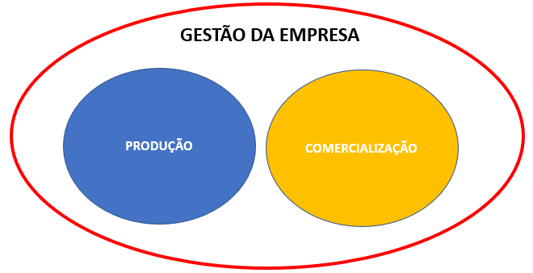

class: center, middle
### O QUE É AGRONEGÓCIO?

```{r setup, include=FALSE}
# Dependências dos slides/aula
library(knitr)          # CRAN v1.33
library(rmarkdown)      # CRAN v2.10
library(xaringan)       # CRAN v0.22
library(xaringanthemer) # CRAN v0.3.0
library(xaringanExtra)  # [github::gadenbuie/xaringanExtra] v0.5.5
library(RefManageR)     # CRAN v1.3.0
library(ggplot2)        # CRAN v3.3.5
library(fontawesome)    # [github::rstudio/fontawesome] v0.1.0
library(pagedown)
library(scales)
library(plotly)
library(dplyr)
library(reshape2)
library(readxl)
library(GetTDData)
library(readr)
library(xts)
library(forecast)
library(mFilter)
library(grid)
library(png)
library(rbcb)
library(Quandl)
library(tidyverse)
library(sidrar)
library(easyGgplot2)
library(lubridate)

# Opções de chunks
options(htmltools.dir.version = FALSE)
knitr::opts_chunk$set(
  echo       = FALSE,
  warning    = FALSE,
  message    = FALSE,
  fig.retina = 3,
  fig.width  = 10,
  fig.asp    = 0.6,
  out.width  = "80%",
  fig.align  = "center",
  comment    = "#"
  )

# Cores para gráficos
colors <- c(
  blue       = "#282f6b",
  red        = "#b22200",
  yellow     = "#eace3f",
  green      = "#224f20",
  purple     = "#5f487c",
  orange     = "#b35c1e",
  turquoise  = "#419391",
  green_two  = "#839c56",
  light_blue = "#3b89bc",
  gray       = "#666666"
  )
```

```{r xaringan, echo=FALSE}
# Tema da apresentação
xaringanthemer::style_mono_light(
  base_color                      = unname(colors["blue"]),
  title_slide_background_image    = params$logo_slides, 
  title_slide_background_size     = 12,
  title_slide_background_position = "bottom 10px right 20px",
  title_slide_background_color    = "white",
  title_slide_text_color          = unname(colors["blue"]),
  footnote_position_bottom        = "15px"
  )

# Opções extras do tema
xaringanExtra::use_progress_bar(
  color    = colors["blue"], 
  location = "bottom"
  )
xaringanExtra::use_extra_styles(
  hover_code_line         = TRUE,
  mute_unhighlighted_code = FALSE
  )
xaringanExtra::use_panelset()
```

```{css, echo=FALSE}
pre {
  white-space: pre-wrap;
  overflow-y: scroll !important;
  max-height: 45vh !important;
  overflow-x: auto;
  max-width: 100%;
}
```

```{r load_refs, echo=FALSE, eval=params$references}
# Configuração de citações
RefManageR::BibOptions(
  check.entries = FALSE,
  bib.style     = "authoryear",
  cite.style    = "authoryear",
  style         = "markdown",
  hyperlink     = FALSE,
  dashed        = FALSE
  )
if(params$references){
  temp_refbib <- tempdir()
  download.file(
    url      = params$references_path, 
    destfile = paste0(temp_refbib, "/references.bib"), 
    mode     = "wb"
    )
  myBib <- RefManageR::ReadBib(paste0(temp_refbib, "/references.bib"), check = FALSE)
  }

# Como citar?
# RefManageR::TextCite(myBib, "id_da_citacao")
```

```{r utils, echo=FALSE}
# Função que pega um arquivo .Rmd, condicionalmente o renderiza, 
# e embute o conteúdo do mesmo formatado como Markdown puro 
# no output do documento atual
print_rmd <- function(file, encoding = "UTF-8", render = TRUE){
  if(render){rmarkdown::render(input = file, quiet = TRUE)}
  rmd <- readLines(con = file, encoding = encoding)
  cat("```md\n")
  cat(rmd, sep = "\n")
  cat("```\n")
}
```

.pull-left[

- A agricultura ou as atividades agropecuárias tem um papel fundamental no desenvolvimento da humanidade. Já se pensou que a agricultura ia impedir o desenvolvimento, pois a população crescia a taxa geométrica e os alimentos a uma taxa aritmética;

- Com o passar dos séculos se constituiu um conjunto de propriedades muito diversificadas, em que se buscava produzir tudo o que se consumia. Eram autossuficientes. Os avanços tecnológicos a partir dos anos 70 do século XX fizeram este quadro mudar. 

- As propriedades passaram a reduzir a diversificação e se produzirem mais uma monocultura. Consequentemente, não são mais autossuficientes.
]

.pull-right[

- Se especializam em determinadas atividades. Passam a depender mais de insumos e produtos que outros produzem.

```{r, echo=FALSE, out.width="70%"}
knitr::include_graphics("https://media.giphy.com/media/PBfRS4TFQRb6mbM3aj/giphy.gif")
```
]

---
class: center, middle
### O QUE É AGRONEGÓCIO?

.pull-left[

- Geram excedentes para abastecer os mercados interno e alguns, o externo. Necessitam de estradas, armazéns, portos, softwares, drones, pesquisas, bolsas de valores. Conquistam novos mercados e sofrem com a concorrência na era da Globalização.

- Toda a evolução que ocorreu (e ainda acontece) no rural levou a necessidade de criar um conceito mais moderno. 

- Simplesmente **agropecuária** ou setor primário já não era mais suficiente para dar conta do que se observava no campo.
]

.pull-right[

- Assim surgiu o conceito de Agribusiness, com origem no trabalho de Davis e Goldberg (1957): "o conjunto de todas as operações e transações envolvidas desde a fabricação dos insumos agropecuários, das operações de produção nas unidades agropecuárias, até o processamento e distribuição e consumo dos produtos agropecuários 'in natura' ou industrializados".

- O agronegócio envolve um conjunto de funções antes, dentro e depois da porteira: a) suprimentos para a produção agropecuária; b) a própria produção agropecuária; c) transformação; d) armazenamento; e) distribuição; f) consumo; g) serviços complementares (publicidade, bolsas de valores, pesquisa). 
]

---
class: center, middle

```{r, echo=FALSE, out.width="65%"}

```

---
class: center
### PIB AGRONEGÓCIO

.pull-left[

```{r, echo=FALSE, out.width="100%"}

```

]

.pull-right[

```{r, echo=FALSE, out.width="100%"}

```

]

---
class: center
### BIOECONOMIA

```{r, echo=FALSE, out.width="85%"}

```

---
class: center
### BIOECONOMIA

```{r, echo=FALSE, out.width="80%"}

```

---
class: center, middle
### BIOECONOMIA

.pull-left[

- O Projeto de Lei 150-2022 tem o objetivo de instituir a Política brasileira de Bioeconomia. A mesma entende bioeconomia como a produção, utilização e a conservação de recursos biológicos, incluindo os conhecimentos, ciência, tecnologia e inovação relacionados, para fornecer informações, produtos, processos e serviços em todos os setores econômicos, visando ao desenvolvimento sustentável. 

- Na parte da estratégia nacional de Bioeconomia, destacam-se: a)  A ampliação sustentável da oferta de fármacos e de cosméticos; b)
A ampliação sustentável da oferta de biocombustíveis; c) A ampliação da produção de biomateriais de alto valor agregado;

]

.pull-right[

- d) A intensificação de agropecuária em bases sustentáveis e a ampliação da bioagricultura; e) A adequação dos processos produtivos para a baixa intensidade de carbono em todo o ciclo de vida da produção da bioeconomia.

- É um conceito que tem evoluído com o passar do tempo, mas com elementos convergentes como a origem na agropecuária, transversalidade e produção com uso de tecnologias cada vez mais avançadas. 
 
- Os serviços ecossistêmicos, sistemas de crédito de carbono, ecoturismo, gestão e valoração da água e da preservação da biodiversidade também são pontos considerados dentro da bioeconomia. 
]

---
class: center, middle
### CADEIA PRODUTIVA

.pull-left[

- "Um conjunto de etapas consecutivas, ao longo das quais os diversos insumos sofrem algum tipo de transformação, até a constituição de um produto final (bem ou serviço) e sua colocação no mercado".

- A articulação na cadeia produtiva é amplamente influenciada pelas possibilidades tecnológicas e definida pelas estratégias dos agentes. Estes possuem relações interdependentes e complementares, determinados pelas forças hierárquicas.

- A análise de cadeias produtivas permite descrever toda a cadeia; reconhecer o papel da tecnologia na estruturação da cadeia; organizar estudos sobre integração produtiva;

]

.pull-right[

-  Permite ainda avaliar políticas para o agronegócio; compreender a matriz insumo produto; analisar as estratégias das empresas via estudos de poder de mercado.

```{r, echo=FALSE, out.width="120%"}

```

]

---
class: center, middle

```{r, echo=FALSE, out.width="90%"}

```

---
class: center, middle
### CADEIA PRODUTIVA

.pull-left[

- **Consumidor**- Ponto principal da cadeia produtiva. É o consumidor quem compra os produtos e traz o recurso monetário que irá financiar todos os fluxos do sistema agroalimentar (SAG). 


```{r, echo=FALSE, out.width="90%"}
knitr::include_graphics("https://media.giphy.com/media/D7z8JfNANqahW/giphy.gif")
```

]

.pull-right[

- É quem direciona o caminho que o SAG deve seguir. Se o consumidor mudar seu padrão de consumo, em termos de exigência, por exemplo, maior preocupação com a qualidade de vida do trabalhador e/ou do meio ambiente, todos terão que se adaptar.

- O produtor que se adapta aos padrões dos consumidores. Não são os consumidores que vão se adaptar ao que os produtores querem oferecer. 

- Por outro lado, certamente existem diferentes perfis de consumidores, com diferentes preferências e dispostos a pagar diferentes valores pelos produtos.

]

---
class: center, middle
### CADEIA PRODUTIVA

.pull-left[

- O **Varejo** - vai desde os açougues, padarias e mercadinhos de bairro, até as grandes redes internacionais, como o Walmart. É o elo com maior contato com o consumidor final e que normalmente acaba tendo maior poder de coordenação do SAG.

- O **Atacado** - São locais que concentram produtos e tem a tarefa de fazer a distribuição para os varejistas. Atualmente as grandes redes possuem suas próprias centrais de distribuição. Em alguns casos, existe para certos produtos uma integração vertical na qual o varejista é dono da produção e faz a ligação direta, sem passar pelos atacadistas.

]

.pull-right[

- A **Agroindústria** - faz a transformação da matéria-prima em um outro produto para o consumo. Existem agroindústrias de diversos tamanhos, desde familiares até grandes conglomerados internacionais. Lida tanto com o produtor, que lhe entrega a matéria prima, quanto com o distribuidor. Ela precisa garantir a demanda de matérias-primas e entregar os produtos para os varejistas.

- A **produção primária** - Estão mais distantes do consumidor final, dispersos geograficamente e heterogêneos. Uma atividade repleta de riscos diversos. Contudo, os produtores aos poucos tem se tornado mais profissionais e entendido que a atividade tem o objetivo de dar lucro. 

]

---
class: center, middle
### CLUSTER

.pull-left[

- "É um grupo econômico constituído por empresas instaladas em determinada região, líderes em seus ramos, apoiado por outras que fornecem produtos e serviços, ambas sustentadas por organizações que oferecem profissionais qualificados, tecnologias de ponta, recursos financeiros, ambiente propício para negócios e infraestrutura física. 

- Todas estas organizações interagem, ao proporcionarem umas às outras os produtos e serviços que necessitam, estabelecendo, deste modo, relações que permitem produzir mais e melhor, a um custo menor. O processo torna as empresas mais competitivas".

- A organização do setor em **cluster** propicia um ambiente adequado ao fortalecimento das empresas.

]

.pull-right[

- Apesar de competirem pelo mesmo mercado, cooperam para aumentar a produtividade geral da comunidade na qual se inserem. Vale dizer, criam
sinergias. 

```{r, echo=FALSE, out.width="70%"}
knitr::include_graphics("img_r/agro6.png")
```

]

---
class: center
### O QUE VAI FAZER A DIFERENÇA NO CURTO PRAZO 

```{r, echo=FALSE, out.width="100%"}

```

---
class: center
### PROFISSIONALIZAR, CUIDAR DA GESTÃO DO NEGÓCIO

```{r, echo=FALSE, out.width="95%"}

```


---
class: center, middle
### GESTÃO DO AGRONEGÓCIO

.pull-left[

- A gestão depende do porte da empresa ou da propriedade rural. 

- Cada vez mais modernas e tecnificadas, as propriedades rurais precisam aumentar a sua competitividade, reduzir os custos de produção, aumentar o faturamento.

-  Contudo, ainda existem, no meio rural, muitos produtores que trabalham basicamente para a subsistência da família.

]

.pull-right[

- Em Geral, os empreendimentos podem ser divididos em: rural tradicional, agronegócio em transição e agronegócio moderno.

- No rural tradicional não se tem muita tecnologia inserida no processo de produção, base toda familiar, dependente totalmente da política agrícola, das condições climáticas e baixo poder de mercado na hora de comercializar sua safra.

- A produção é definida pelo histórico regional ou familiar, com baixa produtividade devido ao pouco uso de tecnologia. Ser pouco intensivo em tecnologia pode ser devido a limitação financeira do produtor, sua resistência ao novo ou defasagem do técnico que presta assistência. 

]

---
class: center, middle
### GESTÃO DO AGRONEGÓCIO

.pull-left[

- No **agronegócio em transição** já se tem a introdução de técnicas mais modernas de produção e administração, preocupação com permanência no mercado e busca para aumento de competitividade a médio e longo prazos.

- Para isto ocorrer vai ser necessário pensar em reduzir custos, ter escala para ter regularidade de oferta e qualidade. 

- Não é fácil realizar a passagem de tradicional para em transição pois exige entendimento de cadeia de produção, capacidade técnica e econômica, além de receber "pressão" dos demais segmentos da cadeia produtiva.

]

.pull-right[

-  No agronegócio moderno se tem um equilíbrio entre os aspectos de capacitação gerencial, adequação tecnológica e desempenho econômico.

- São os empreendimentos que mais usam os recursos oferecidos pelos centros de pesquisa e extensão existentes.

- Nas produções de ciclo curto é necessário menor capacidade econômica para passar períodos de crise, pois o produto pode ser substituído rapidamente.

- Nas produção de ciclo longo, é preciso maior capacidade econômica, os custos de se interromper uma atividades são mais elevados e muitos irrecuperáveis.

]

---
class: center
### GESTÃO DO AGRONEGÓCIO

.pull-left[

- No geral, ou a safra é vendida diretamente para algum canal de distribuição que faz chegar no varejo ou ela vai para a agroindústria processadora.

- A escala de produção e o tipo de produto são importantes para ajudar a definir o destino da produção. Cada destino faz as suas exigências.

- Se o destino for a agroindústria processadora, existem produtos que precisam entregar alto nível de qualidade, como carnes e leite. Existem outros que os produtos são de baixa qualidade: uva para vinagre ou manga para polpa.

]

.pull-right[

- Se o destino for supermercados, centrais de abastecimento e grandes atacadistas estes impõe uma série de condições junto aos produtores.

- Estas condições vão desde a embalagem, qualidade do produto, rastreabilidade, certificações, etc.

- Sabor original, sanidade e aparência atrativa - fatores chave para o produto poder entrar dentro do supermercado.

- O produtor só vai conseguir entender o processo (e como pode se inserir) se ele entender o negócio como uma empresa, entender o mercado;

]

---
class: center, middle
### GESTÃO DO AGRONEGÓCIO


```{r, echo=FALSE, out.width="70%"}

```


---
class: center, middle
### GESTÃO DO AGRONEGÓCIO

.pull-left[

```{r, echo=FALSE, out.width="100%"}

```

]

.pull-right[

```{r, echo=FALSE, out.width="100%"}

```

]

---
class: center, middle
### GESTÃO DO AGRONEGÓCIO

.pull-left[

```{r, echo=FALSE, out.width="100%"}

```

]

.pull-right[

```{r, echo=FALSE, out.width="100%"}

```

]

---
class: center, middle
### GESTÃO DO AGRONEGÓCIO

.pull-left[

```{r, echo=FALSE, out.width="100%"}

```

]

.pull-right[

```{r, echo=FALSE, out.width="100%"}

```

]

---
class: center, middle
### LOGÍSTICA

.pull-left[

- Definição: Estabelece a integração dos fluxos físicos e de informações, responsáveis pela movimentação de materiais e produtos, desde a previsão das necessidades para fornecimento de matérias-primas e componentes, passando pelo planejamento da produção e consequente programação de suprimento aos canais de distribuição para o mercado consumidor.

- As três etapas de atuação da logística na empresa, são: a) Antes da produção é o fornecimento dos insumos (logística de entrada); b) Apoio à produção em si; c) Depois da produção tem a distribuição dos produtos pelos seus canais de distribuição (logística de saída).

]

.pull-right[

- A gestão logística cuida da movimentação geral dos produtos desde os insumos até a distribuição, enfrentando os problemas da distância que separa clientes e fornecedores.

- O objetivo da logística é evitar quebras de suprimento nos pontos de venda e evitar abarrotamento nos agentes de toda a cadeia de suprimentos. 
- Os custos logísticos tem muita importância nos custos de produção dos produtos do agronegócio. A logística agroindustrial tenta disponibilizar os produtos no momento e em quantidades adequadas, com o menor custo, em diferentes lugares, procurando manter estoques mínimos para atender as necessidades e com maior tempo de vida útil do produto.

]

---
class: center, middle
### LOGÍSTICA

.pull-left[

- A Figura separa as atividades dos fluxos da cadeia. Os insumos precisam ser comprados dos fornecedores e este processo precisa acontecer com a máxima eficiência e menores custos. Nas empresas ocorrem os processos produtivos, que precisam de apoio (infraestrutura, tecnologia, pessoas). O marketing, pessoal de vendas, SAC, tudo contribui para a distribuição da produção para os clientes. 

- A Figura não explicita, mas as atividades de gestão são fundamentais: gestão de relacionamento com clientes; gestão e desenvolvimento com fornecedores; gestão da demanda; gestão de pedidos.

]

.pull-right[

```{r, echo=FALSE, out.width="100%"}

```

]

---
class: center, middle
### LOGÍSTICA

.pull-left[

- A logística está presente em todas as transações que ocorrem entre as empresas em uma cadeia de suprimento.

- Cada transação admite um ciclo de operações (desempenho). A integração na cadeia de suprimento considera a sincronização de diferentes ciclos de desempenho.

- No Vale do São Francisco é possível produzir durante todo o ano. O quanto se vai produzir, em cada período, durante o ano inteiro, necessita programação.

- Com a programação feita é preciso saber quanto será necessário de insumos e a data da compra. Não é possível faltar nem ficar com muita coisa estocada.

]

.pull-right[

- É necessário ter um volume mínimo para o *packing house* funcionar. Existem períodos que são necessários mais e outros que precisam de menos pessoas. Precisa planejar  para não ter excesso nem escassez de mão de obra.

- Frutas, por exemplo, são bastante perecíveis. Se for para mercado interno, tem uma data de colheita, se for para exportação áereo, tem outro ponto de maturação para colheita; se for transporte marítimo, precisa colher mais cedo.

- E tudo depende da demanda, dos contratos que foram fechados. Isto gera a necessidade de ciclos de operações diversas, com fluxos de informações (financeiros inclusive) e físicos.

]

---
class: center, middle
### LOGÍSTICA - SUPRIMENTOS

.pull-left[

- Suprimento para o cliente é a distribuição física do fornecedor. É o processo de obtenção de produtos e materiais de fornecedores externos à empresa. É um fluxo de produtos para dentro da empresa.

- A empresa está recebendo a distribuição física de uma outra empresa. O objetivo do suprimento é dar apoio à produção, oferecendo materiais e produtos no tempo certo e com o menor custo total.

- O pessoal de suprimentos é quem compra para a empresa. São os responsáveis pela manutenção do nível de operação, tanto as produtivas quanto as comerciais.

- A produção e a consequente venda não pode parar por erro na compra de suprimentos;

]

.pull-right[

- Já existe uma programação do pessoal de suprimentos mas esta pode ser ajustada com base nas informações recebidas. O ideal é organizar de forma a se obter vantagens de economia de escala.

- Este pessoal precisa ter planejamento, fornecedores, saber negociar, efetuar os pedidos e garantir que cheguem até os clientes (produção);

- Para fazer planejamento, precisam ter previsões de vendas futuras para se pensar na demanda necessária.

- Em geral estas previsões são para até um ano.

- A meta sempre vai ser erro zero na previsão das necessidades diversas.

]

---
class: center, middle
### LOGÍSTICA - APOIO À PRODUÇÃO

.pull-left[

- A produção precisa ser planejada e também ser controlada.

- No Plano de Produção se especifica o que a empresa irá produzir durante a safra (agronegócio) baseado tanto nos contratos firmados com as empresas (supermercados, atacadistas, importadores em geral, etc.) quanto em previsões de vendas com bases nas analises de sazonalidade dos produtos.

- No caso da Fruticultura do Vale do São Francisco se pode produzir durante todos os meses do ano, não se tem apenas o "ciclo natural".

- Se sabe que a produção no segundo semestre é maior do que no primeiro. Os fatores climáticos afetam a produção. 
]

.pull-right[

- É preciso preparar a área (tratos culturais, limpeza, poda das árvores), verificar os insumos, sistema de irrigação, quantidade de mão de obra que será necessária além de máquinas e equipamentos.

-  A questão da mão de obra exige bastante atenção. Em determinados momentos se precisa de mais trabalhadores do que em outros. A terceirização de partes do processo é uma tendência no Vale.

- Tomar muito cuidado para não errar nas aplicações dos produtos. 

- Quem exporta precisa ainda se preocupar com o *packing* e com as **certificações**.
]

---
class: center, middle
### LOGÍSTICA - DISTRIBUIÇÃO FÍSICA

.pull-left[

- O preço de um produto depende não apenas do seu custo de produção mas também da gestão logística para sua distribuição na cadeia de suprimento. 
- Os produtos percorrem cada vez mais distâncias longas para chegar aos consumidores. Vide o melão brasileiro que vai começar a ser exportador para  China; a manga que vai para a Rússia!

- A fruticultura tem maiores dificuldades por ser um produto perecível!

- O gerenciamento da distribuição física refere-se à administração da movimentação de produtos aos clientes/consumidores em um canal de distribuição.

]

.pull-right[

- Os produtos precisam ser entregues quando necessário e da forma menos custosa possível.

- A distribuição física requer pedidos recebidos e processados, fluxo de estoques, armazenagem e transporte pelos agentes dos canais de distribuição.

- A distribuição pode ocorrer para atacadistas, varejistas ou atravessadores (intermediários).

- Escolha do modal de transporte (depende da disponibilidade e do custo) é um problemas estratégicos da distribuição física.

]


---
class: center, middle
### LOGÍSTICA - DESEMPENHO LOGÍSTICO

.pull-left[

- O serviço logístico pode estar associado a elementos de pré transação, transação e pós transação.

- Os fatores pré transação são relativas às políticas do serviço oferecido ao cliente, à forma de comunicação dessas políticas ao cliente, à definição das responsabilidades e condições das operações para devolução, prazos de entrega, prioridades, etc.

-  Os fatores de transação (venda) estão relacionados com a entrega do produto ao cliente, disponibilidade em estoque, informações sobre status do pedido, prazos de entrega, erros, substituição de produtos pedidos, etc.

]

.pull-right[

- Os fatores pós transação são relacionados ao acompanhamento do produto depois de sua transferência para o cliente: atendimento a reclamações, trocas, etc.

- O serviço logístico cria facilidades aos clientes e isto favorece o fechamento dos negócios. Não atender o mercado significa perder clientes. Por medidas do nível de serviço entende-se: disponibilidade, competência e qualidade. Disponibilidade é a habilidade da empresa em disponibilizar os produtos para atender os pedidos.

- A competência é entregar os produtos sem erros. A qualidade representa a condição da empresa em dar todas as informações sobre os pedidos e assistência aos clientes, quando este recebe o produto.

]

---
class: center, middle
### LOGÍSTICA - TRANSPORTE

.pull-left[

- Responsável pela movimentação de materiais e produtos acabados;

- Na Fruticultura se tem o transporte de máquinas e insumos, transporte do campo para o Packing e transporte do Packing/camara fria para as centrais de distribuição ou redes de varejo;

- O transporte para as centrais de distribuição/varejo pode ser feito por caminhão, navio, aéreo, etc.. Uma combinação entre eles também é possível (intermodal);

- O produtor/comprador pode também ser responsável pelo transporte com frota própria ou pode contratar alguém.

]

.pull-right[

- A mercadoria que está sendo transportada ajuda na definição do meio de transporte a ser escolhido;

-  O custo, contudo, é sempre observado pois o modal pode ser muito caro e inviabilizar o transporte. Quanto mais rápido, mais caro. Quanto mais carga em transito, maior o custo de estoque (em transito);

-  Em relação a responsabilidade, os mais comuns são CIF (Cost, Insurance and Freight) ou custo, seguro e frete e FOB (Free on Board) ou livre a bordo.

]

---
class: center, middle

#OBRIGADO!

João Ricardo F. de Lima <br>
Email: joao.ricardo@embrapa.br


https://www.embrapa.br/observatorio-da-manga <br>
https://www.embrapa.br/observatorio-da-uva


Telefones:<br>
87-3866-3667  
87-99961-5799 
