class: center, middle
### COMERCIALIZAÇÃO

```{r setup, include=FALSE}
# Dependências dos slides/aula
library(knitr)          # CRAN v1.33
library(rmarkdown)      # CRAN v2.10
library(xaringan)       # CRAN v0.22
library(xaringanthemer) # CRAN v0.3.0
library(xaringanExtra)  # [github::gadenbuie/xaringanExtra] v0.5.5
library(RefManageR)     # CRAN v1.3.0
library(ggplot2)        # CRAN v3.3.5
library(fontawesome)    # [github::rstudio/fontawesome] v0.1.0
library(pagedown)
library(scales)
library(plotly)
library(dplyr)
library(reshape2)
library(readxl)
library(GetTDData)
library(readr)
library(xts)
library(forecast)
library(mFilter)
library(grid)
library(png)
library(rbcb)
library(Quandl)
library(tidyverse)
library(sidrar)
library(easyGgplot2)
library(lubridate)

# Opções de chunks
options(htmltools.dir.version = FALSE)
knitr::opts_chunk$set(
  echo       = FALSE,
  warning    = FALSE,
  message    = FALSE,
  fig.retina = 3,
  fig.width  = 10,
  fig.asp    = 0.6,
  out.width  = "80%",
  fig.align  = "center",
  comment    = "#"
  )

# Cores para gráficos
colors <- c(
  blue       = "#282f6b",
  red        = "#b22200",
  yellow     = "#eace3f",
  green      = "#224f20",
  purple     = "#5f487c",
  orange     = "#b35c1e",
  turquoise  = "#419391",
  green_two  = "#839c56",
  light_blue = "#3b89bc",
  gray       = "#666666"
  )
```

```{r xaringan, echo=FALSE}
# Tema da apresentação
xaringanthemer::style_mono_light(
  base_color                      = unname(colors["blue"]),
  title_slide_background_image    = params$logo_slides, 
  title_slide_background_size     = 12,
  title_slide_background_position = "bottom 10px right 20px",
  title_slide_background_color    = "white",
  title_slide_text_color          = unname(colors["blue"]),
  footnote_position_bottom        = "15px"
  )

# Opções extras do tema
xaringanExtra::use_progress_bar(
  color    = colors["blue"], 
  location = "bottom"
  )
xaringanExtra::use_extra_styles(
  hover_code_line         = TRUE,
  mute_unhighlighted_code = FALSE
  )
xaringanExtra::use_panelset()
```

```{css, echo=FALSE}
pre {
  white-space: pre-wrap;
  overflow-y: scroll !important;
  max-height: 45vh !important;
  overflow-x: auto;
  max-width: 100%;
}
```

```{r load_refs, echo=FALSE, eval=params$references}
# Configuração de citações
RefManageR::BibOptions(
  check.entries = FALSE,
  bib.style     = "authoryear",
  cite.style    = "authoryear",
  style         = "markdown",
  hyperlink     = FALSE,
  dashed        = FALSE
  )
if(params$references){
  temp_refbib <- tempdir()
  download.file(
    url      = params$references_path, 
    destfile = paste0(temp_refbib, "/references.bib"), 
    mode     = "wb"
    )
  myBib <- RefManageR::ReadBib(paste0(temp_refbib, "/references.bib"), check = FALSE)
  }

# Como citar?
# RefManageR::TextCite(myBib, "id_da_citacao")
```

```{r utils, echo=FALSE}
# Função que pega um arquivo .Rmd, condicionalmente o renderiza, 
# e embute o conteúdo do mesmo formatado como Markdown puro 
# no output do documento atual
print_rmd <- function(file, encoding = "UTF-8", render = TRUE){
  if(render){rmarkdown::render(input = file, quiet = TRUE)}
  rmd <- readLines(con = file, encoding = encoding)
  cat("```md\n")
  cat(rmd, sep = "\n")
  cat("```\n")
}
```

.pull-left[

- Comercializar é vender algo? Do ponto de vista da empresa, sim.  

- Separar as fases da produção e da comercialização para estudar a competitividade. É preciso ser eficiênte na produção e também eficiente na comercialização.

- Especificamente no caso das frutas, a comercialização é ainda mais difícil. Talvez a comercialização seja até mais difícil do que a produção, se existir recursos para ter tecnologia.

- Assim, é necessário que a empresa encontre os mecanismos de comercialização adequados para poder reduzir os custos de transação. 
]

.pull-right[

```{r, echo=FALSE, out.width="100%"}
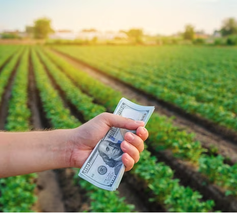
```
]

---
class: center, middle
### ENTENDER A RELAÇÃO ENTRE A OFERTA E A DEMANDA

```{r, echo=FALSE, out.width="90%"}
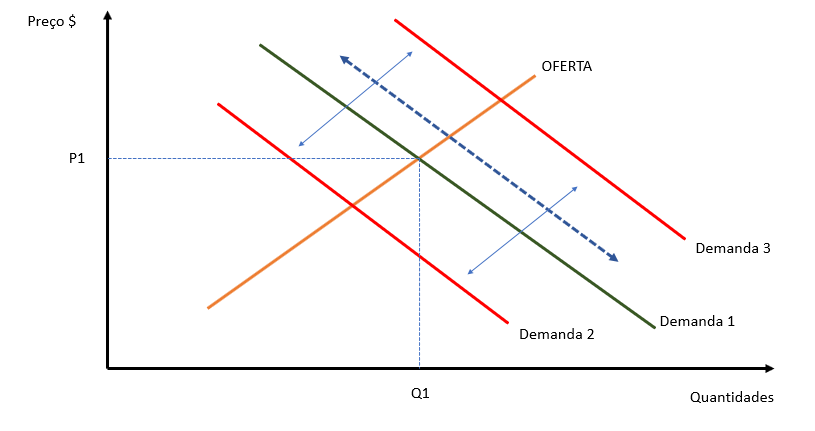
```


---
class: center
### ENTENDER A RELAÇÃO ENTRE A OFERTA E A DEMANDA

.pull-left[

```{r upe1, out.width="200%"}
library(imputeTS)
library(tsutils)
data <- as.Date("2023-08-18")
sem_ano <- 33 #ajustar semanalmente

#Direcionado o R para o Diretorio a ser trabalhado
setwd('/Users/jricardofl/Dropbox/tempecon/dados_Uva')

options(digits=4)

#Entrando dados no R Branca Arra-15
dados1 <- read.csv2('dados_uva_arra_semana.csv', header=T, sep=";", dec=".")
#dados <- dados[,-c(9:10)] #retirar as ultimas colunas
colnames(dados1)[1]<-'produto'


#Entrando dados no R Vitoria com Embalagem
dados2 <- read.csv2('dados_uva_vitoria_semana.csv', header=T, sep=";", dec=".")
#dados <- dados[,-c(9:10)] #retirar as ultimas colunas
colnames(dados2)[1]<-'produto'


#Entrando dados no R Vitoria sem Embalagem
dados3 <- read.csv2('dados_uva_vitoriaSE_semana.csv', header=T, sep=";", dec=".")
#dados <- dados[,-c(9:10)] #retirar as ultimas colunas
colnames(dados3)[1]<-'produto'


#organização das bases para Uva Branca e Vitoria Embalada

#Entrando dados no R - Deflator
igpdi <- read.csv2('igpdi_uva.csv', 
                   header=T, sep=";",
                   dec=".")
colnames(igpdi)[1]<-'ano'

#Juntar tudo em um unico tibble
dados <- full_join(dados1, dados2) %>% full_join(igpdi)

#Resolver os Missing
dados <-na_kalman(dados)

#Deflacionar a série de precos
dados$preco_def <- dados[,4]*(tail(dados[,5],1)/dados[,5])

#Criando uma variável com as datas semanais
dados$date <- seq(as.Date('2017-01-07'),to=data,by='1 week')

#Passar para um Tibble
dados <- tibble(dados)

#Ajustando como uma série temporal
dados <- dados %>% 
  select(c(date, produto, preco_def, ano))

#organização da base para Vitoria Sem Embalagem

igpdi2 <- igpdi %>% filter(ano >= '2019')

#Juntar tudo em um unico tibble
dadosv <- full_join(dados3, igpdi2)

#Resolver os Missing
dadosv <-na_kalman(dadosv)

#Deflacionar a série de precos
dadosv$preco_def <- dadosv[,4]*(tail(dadosv[,5],1)/dadosv[,5])

#Criando uma variável com as datas semanais
dadosv$date <- seq(as.Date('2019-01-07'),to=data,by='1 week')

#Passar para um Tibble
dadosv <- tibble(dadosv)

#Ajustando como uma série temporal
dadosv <- dadosv %>% 
  select(c(date, produto, preco_def, ano))


#Geração das tendencias

arra <- dados%>% filter(produto=="arra_15")
vitoria <- dados %>% filter(produto=="vitoria")
vitoriase <- dadosv

preco_arra <- ts(arra[,3], start=c(2017,1), freq=52)
sazonal_arra <- cmav(preco_arra, outplot = F)

preco_vitoria <- ts(vitoria[,3], start=c(2017,1), freq=52)
sazonal_vitoria <- cmav(preco_vitoria, outplot = F)

preco_vitoriase <- ts(vitoriase[,3], start=c(2019,1), freq=52)
sazonal_vitoriase <- cmav(preco_vitoriase, outplot = F)


#Decompor a Série
decompa<-decompose(preco_arra, type = 'multiplicative')

sazonalidade <- decompa$figure
semanas <- seq(1:52)
sazonal_graph <- tibble(cbind(semanas, sazonalidade))

g2 <- ggplot(data=sazonal_graph)+
  geom_line(aes(x=semanas, y=sazonalidade), color="blue", size=1)+
  scale_y_continuous(limits=c(0,1.5), n.breaks = 5, expand = expansion(add=c(0,0.5)), 
                     labels=number_format(accuracy = 0.01, decimal.mark = ","))+
  scale_x_continuous(breaks = seq(1, 52, by = 3))+
  labs(y= "Sazonalidade Uva Branca Sem Semente", x= "Semanas de cada Ano", title='',
       caption = "Fonte: Observatório de Mercado de Uva da Embrapa")+
  theme_classic()+
  theme(axis.text.x=element_text(angle=0, hjust=0.5, size=10, margin = margin(b=20)),
        axis.text.y=element_text(hjust=0.5, size=10, margin = margin(l=20)),
        axis.title.y = element_text(size=10, face = "bold"),
        axis.title.x = element_text(size=10, face = "bold"),
        panel.grid.major = element_blank(),
        panel.grid.minor = element_blank(),
        plot.caption = element_text(hjust = 0, size=14),
        legend.position = "bottom", legend.title = element_blank(),
        legend.text=element_text(size=10)) # Definindo posição da legenda

g2
```

]

.pull-right[


```{r upe2, echo=FALSE, out.width="200%"}
seasplot(preco_arra, outplot = 5)
```
]


---
class: center
### ENTENDER A RELAÇÃO ENTRE A OFERTA E A DEMANDA

.pull-left[

```{r upe3, echo=FALSE, out.width="200%"}
#Decompor a Série
decompa<-decompose(preco_vitoriase, type = 'multiplicative')

sazonalidade <- decompa$figure
semanas <- seq(1:52)
sazonal_graph <- tibble(cbind(semanas, sazonalidade))

g3 <- ggplot(data=sazonal_graph)+
  geom_line(aes(x=semanas, y=sazonalidade), color="blue", size=1)+
  scale_y_continuous(limits=c(0,1.5), n.breaks = 5, expand = expansion(add=c(0,0.5)), 
                     labels=number_format(accuracy = 0.01, decimal.mark = ","))+
  scale_x_continuous(breaks = seq(1, 52, by = 3))+
  labs(y= "Sazonalidade Uva Negra Sem Semente Contentor", x= "Semanas de cada Ano", title='',
       caption = "Fonte: Observatório de Mercado de Uva da Embrapa")+
  theme_classic()+
  theme(axis.text.x=element_text(angle=0, hjust=0.5, size=10, margin = margin(b=20)),
        axis.text.y=element_text(hjust=0.5, size=10, margin = margin(l=20)),
        axis.title.y = element_text(size=10, face = "bold"),
        axis.title.x = element_text(size=10, face = "bold"),
        panel.grid.major = element_blank(),
        panel.grid.minor = element_blank(),
        plot.caption = element_text(hjust = 0, size=14),
        legend.position = "bottom", legend.title = element_blank(),
        legend.text=element_text(size=10)) # Definindo posição da legenda

g3
```

]

.pull-right[

```{r upe4, echo=FALSE, out.width="200%"}
seasplot(preco_vitoriase, outplot = 5)
```

]

---
class: center
### ENTENDER A RELAÇÃO ENTRE A OFERTA E A DEMANDA

.pull-left[

```{r upe5, echo=FALSE, out.width="200%"}
#Direcionado o R para o Diretorio a ser trabalhado
setwd('/Users/jricardofl/Dropbox/tempecon/dados_manga')

today <- as.Date("2023-08-18")

#Entrando dados no R
dados <- read.csv2('dados_manga_palmer_semana.csv', header=T, sep=";", dec=".")
#dados <- dados[,-c(9:10)] #retirar as ultimas colunas
colnames(dados)[1]<-'produto'

#Entrando dados no R - Deflator
igpdi <- read.csv2('igpdi.csv', 
                   header=T, sep=";",
                   dec=".")

dados_comb<-cbind(dados, igpdi)

teste<-dados_comb[,4]-dados_comb[,7]

dadosp<-dados_comb[,-c(1,2,6,7)]

#Deflacionar a serie de manga
dadosp$preco_def <- dadosp[,3]*(tail(dadosp[,4],1)/dadosp[,4])
#dadosp<-dadosp[,-2]

#Criando uma variável com as datas semanais
dadosp$date <- seq(as.Date('2012-01-14'),to=today,by='1 week') 
dadosp$date[dadosp$date == "2016-01-02"] <- "2015-12-31" #ajustando algumas datas
dadosp$date[dadosp$date == "2015-01-03"] <- "2014-12-31"
dadosp$date[dadosp$date == "2014-01-04"] <- "2013-12-31"
dadosp$date[dadosp$date == "2013-01-05"] <- "2012-12-31"
dadosp$date[dadosp$date == "2022-01-01"] <- "2022-01-03"
dadosp$date[dadosp$date == "2022-12-31"] <- "2023-01-01"

#Analise de Serie Temporal
preco_palmer <- dadosp[,5]
preco_palmer <- ts(preco_palmer, start=c(2012,1), freq=52)
#preco_palmer <- window(preco_palmer, end=c(2021,52))

trend_palmer <- cmav(preco_palmer, outplot=F)

#Decompor a Série
decompa<-decompose(preco_palmer, type = 'multiplicative')

sazonalidade <- decompa$figure
semanas <- seq(1:52)
sazonal_graph <- tibble(cbind(semanas, sazonalidade))

g4 <- ggplot(data=sazonal_graph)+
  geom_line(aes(x=semanas, y=sazonalidade), color="blue", size=1)+
  scale_y_continuous(limits=c(0,1.5), n.breaks = 5, expand = expansion(add=c(0,0.5)), 
                     labels=number_format(accuracy = 0.01, decimal.mark = ","))+
  scale_x_continuous(breaks = seq(1, 52, by = 3))+
  labs(y= "Sazonalidade Manga Palmer", x= "Semanas de cada Ano", title='',
       caption = "Fonte: Observatório de Mercado de Manga da Embrapa")+
  theme_classic()+
  theme(axis.text.x=element_text(angle=0, hjust=0.5, size=10, margin = margin(b=20)),
        axis.text.y=element_text(hjust=0.5, size=10, margin = margin(l=20)),
        axis.title.y = element_text(size=10, face = "bold"),
        axis.title.x = element_text(size=10, face = "bold"),
        panel.grid.major = element_blank(),
        panel.grid.minor = element_blank(),
        plot.caption = element_text(hjust = 0, size=14),
        legend.position = "bottom", legend.title = element_blank(),
        legend.text=element_text(size=10)) # Definindo posição da legenda

g4
```

]


.pull-right[

```{r upe6, echo=FALSE, out.width="200%"}
seasplot(preco_palmer, outplot = 5)
```

]

---
class: center
### ENTENDER A RELAÇÃO ENTRE A OFERTA E A DEMANDA

.pull-left[

```{r upe7, echo=FALSE, out.width="200%"}
#Direcionado o R para o Diretorio a ser trabalhado
setwd('/Users/jricardofl/Dropbox/tempecon/dados_manga')

today <- as.Date("2023-08-18")

#Entrando dados no R
dados <- read.csv2('dados_manga_tommy_semana.csv', header=T, sep=";", dec=".")
#dados <- dados[,-c(9:10)] #retirar as ultimas colunas
colnames(dados)[1]<-'produto'

#Entrando dados no R - Deflator
igpdi <- read.csv2('igpdi.csv', 
                   header=T, sep=";",
                   dec=".")

dados_comb<-cbind(dados, igpdi)

teste<-dados_comb[,4]-dados_comb[,7]

dadosp<-dados_comb[,-c(1,2,6,7)]

#Deflacionar a serie de manga
dadosp$preco_def <- dadosp[,3]*(tail(dadosp[,4],1)/dadosp[,4])
#dadosp<-dadosp[,-2]

#Criando uma variável com as datas semanais
dadosp$date <- seq(as.Date('2012-01-14'),to=today,by='1 week') 
dadosp$date[dadosp$date == "2016-01-02"] <- "2015-12-31" #ajustando algumas datas
dadosp$date[dadosp$date == "2015-01-03"] <- "2014-12-31"
dadosp$date[dadosp$date == "2014-01-04"] <- "2013-12-31"
dadosp$date[dadosp$date == "2013-01-05"] <- "2012-12-31"
dadosp$date[dadosp$date == "2022-12-31"] <- "2023-01-01"

#Analise de Serie Temporal
preco_tommy <- dadosp[,5]
preco_tommy <- ts(preco_tommy, start=c(2012,1), freq=52)
#preco_tommy <- window(preco_tommy, end=c(2021,52))

trend_tommy <- cmav(preco_tommy, outplot=F)

#Decompor a Série
decompa<-decompose(preco_tommy, type = 'multiplicative')

sazonalidade <- decompa$figure
semanas <- seq(1:52)
sazonal_graph <- tibble(cbind(semanas, sazonalidade))

g4 <- ggplot(data=sazonal_graph)+
  geom_line(aes(x=semanas, y=sazonalidade), color="blue", size=1)+
  scale_y_continuous(limits=c(0,1.5), n.breaks = 5, expand = expansion(add=c(0,0.5)), 
                     labels=number_format(accuracy = 0.01, decimal.mark = ","))+
  scale_x_continuous(breaks = seq(1, 52, by = 3))+
  labs(y= "Sazonalidade Manga Tommy", x= "Semanas de cada Ano", title='',
       caption = "Fonte: Observatório de Mercado de Manga da Embrapa")+
  theme_classic()+
  theme(axis.text.x=element_text(angle=0, hjust=0.5, size=10, margin = margin(b=20)),
        axis.text.y=element_text(hjust=0.5, size=10, margin = margin(l=20)),
        axis.title.y = element_text(size=10, face = "bold"),
        axis.title.x = element_text(size=10, face = "bold"),
        panel.grid.major = element_blank(),
        panel.grid.minor = element_blank(),
        plot.caption = element_text(hjust = 0, size=14),
        legend.position = "bottom", legend.title = element_blank(),
        legend.text=element_text(size=10)) # Definindo posição da legenda

g4
```

]


.pull-right[

```{r upe8, echo=FALSE, out.width="200%"}
seasplot(preco_tommy, outplot = 5)
```

]

---
class: center
### MECANISMOS DE COMERCIALIZAÇÃO

.pull-left[

- Segundo a NEI (Nova Economia Institucional), as comercializações diferem em termos de: riscos, frequência, informação e especificidades dos investimentos envolvidos.

- Importante ter isto em mente quando for escolher a forma de comercializar.

- Lembrando que frutas não são *commodities* porque são perecíveis e isto aumenta o risco flutuações de preços.  

- Para ser uma **commodity** um produto precisa atender pelo menos três requisitos: a) padronização no contexto do mercado internacional; b) possibilidade de entrega nas datas acordadas entre comprador e vendedor; c) possibilidade de armazenagem ou venda em unidades padronizadas.

]

.pull-right[

- **Mercado Spot**: transações que se resolvem em um único instante do tempo. Não existe a obrigatoriedade de compra futura. Problemático quando se necessita de estabilidade dos suprimentos e quando preços e qualidade são fundamentais.

- Derivativos *"é o nome dado à família de mercados em que as operações com liquidação futura são implementadas, tornando possível a gestão de risco de preço de diversos ativos"*. 

- O negócio com derivativos segue a Lei da Oferta e da Demanda, não existe controle de preços. A formação de preços futuros derivam do mercado físico e das expectativas futuras sobre os preços. 

]


---
class: center
### MECANISMOS DE COMERCIALIZAÇÃO

.pull-left[

- Usando contratos de derivativos o produtor trava os preços futuros para seus produtos, eliminando as incertezas do mercado spot. 

- **Mercado a Termo**: Quando se faz um contrato e as partes (balcão) acordam que alguns ou todos os elementos da transação podem ocorrer no futuro (entrega, pagamento, etc.). O preço é previamente combinado.

- Acontece também do pagamento (parte) ser feito de forma antecipada, com o produtor usando o dinheiro para fazer o custeio da safra. Problema é que o produtor pode acabar não entregando a produção ou o preço pago ser mais baixo que o mercado na época da colheita.

]

.pull-right[

- Se for no mercado de bolsa (**Mercado Futuro**), os contratos são padronizados e as partes não vão se conhecer. É uma evolução do contrato a termo. 

- É uma obrigação, legalmente elegível, de entregar ou receber uma determinada quantidade de uma mercadoria, de qualidade pré-estabelecida, pelo preço ajustado no pregão. 

- **Mercado de opções**: onde se negociam contratos de opções. Nestes mercados, se paga um certo valor para se ter o direito, mas não a obrigação, de escolha de um determinado curso de ação no mercado (comprar um produto a um preço pré-determinado, por exemplo).

]

---
class: center
### COMERCIALIZAÇÃO

.pull-left[

- **Regularidade de suprimento** é um item fundamental para se poder comercializar em condições mais vantajosas.

- Assim, é preciso ter volume para se conseguir atender o mercado com a periodicidade desejada. E deste ponto de vista, os **corretores/atravessadores** são importantes para se ter fluxo de distribuição. 

- **Qualidade dos produtos** é outro ponto fundamental na comercialização. A qualidade nem deveria ser pauta de discussão, pois produção sem qualidade nem deveria ir para o Mercado. Exemplo: Produtos da *Boa Fruta*. 

]

.pull-right[

```{r, echo=FALSE, out.width="100%"}
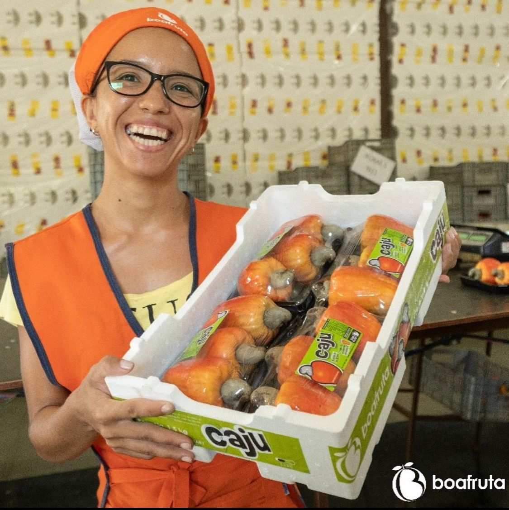
```

]

---
class: center, middle
### MARKETING

```{r, echo=FALSE, out.width="60%"}
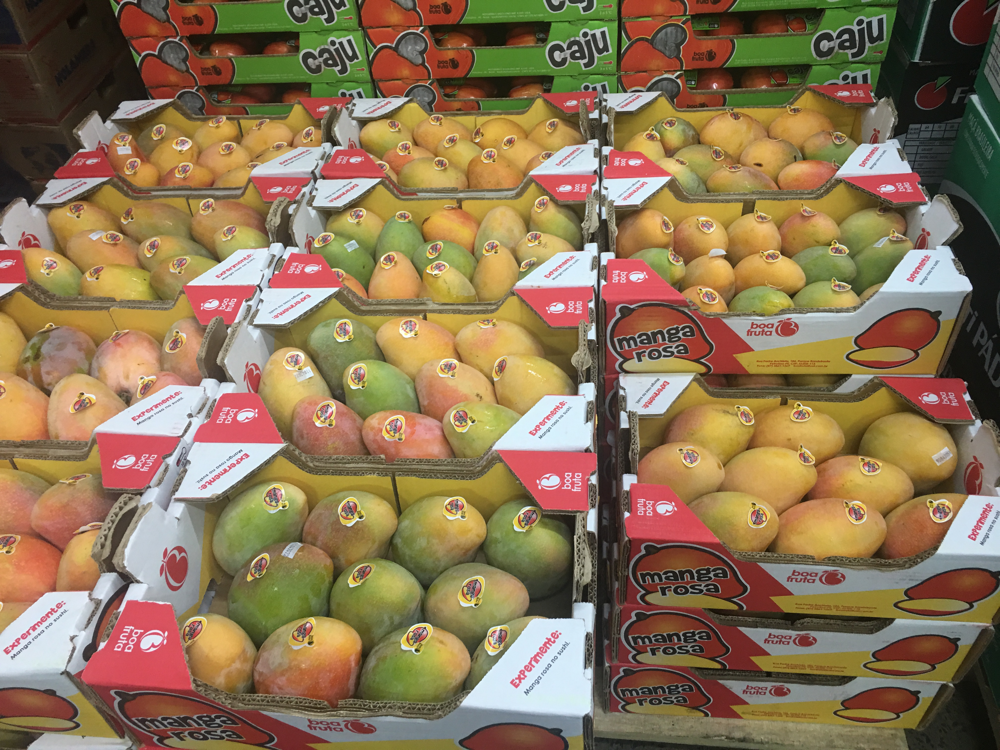
```

---
class: center
### COMERCIALIZAÇÃO - APOIO DO ESTADO

.pull-left[

- Politicas  Públicas como o PNAE (Programa Nacional de Alimentação Escolar) e o PAA (Programa de Aquisição de Alimentos)) possuem efeito econômico, social e ambiental, além de contribuir com a segurança do alimento e com a segurança alimentar.

- Abertura de novos mercados. 

- Política de garantia de preços mínimos. 

- Aquisições do Governo Federal (AGF's) e Empréstimos do Governo Federal (EGF's), Cédula do Produtor Rural (CPR), Premio por Escoamento de Produto (PEP), etc. 

]

.pull-right[

```{r, echo=FALSE, out.width="100%"}
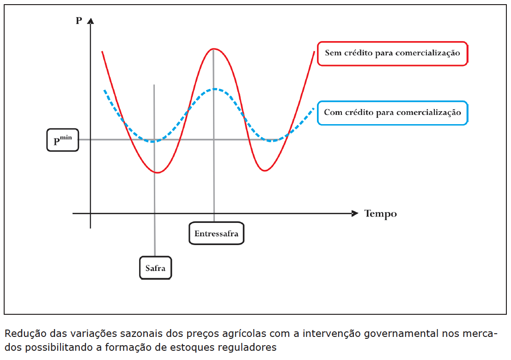
```

]

---
class: center
### COMERCIALIZAÇÃO - APOIO DO ESTADO

.pull-left[

- O Brasil está inserido em um *mercado internacional protecionista*. O **Protecionismo** desvaloriza a agropecuária em países em desenvolvimento, pois ele usa a prática de redução de preços internacionais de equilíbrio, que ficam desajustados.

```{r, echo=FALSE, out.width="110%"}
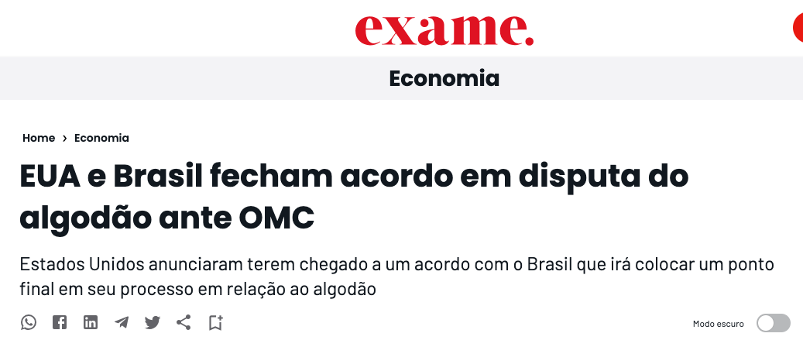
```

]

.pull-right[

- Qual o motivo de alguns países protegerem suas agriculturas? Em última instância é a preocupação com a renda dos agricultores. Nos países mais desenvolvidos as desigualdades são menores e isto vale para as atividades urbanas comparadas com as rurais também. 

- O problema são as distorções que ocorrem devido a esta política: Redução das importações, das quantidades consumidas, aumento da oferta de exportações dos países protegidos, redução de exportações dos países prejudicados com o protecionismo.

- Com livre mercado, o Brasil seria bastante beneficiado devido a sua competitividade em diversas cadeias agroindustriais.

]

---
class: center
### COMERCIALIZAÇÃO - IMPORTÂNCIA DO MARKETING

<iframe width="760" height="515" src="https://www.youtube.com/embed/jBIGvxaya34" title="YouTube video player" frameborder="0" allow="accelerometer; autoplay; clipboard-write; encrypted-media; gyroscope; picture-in-picture; web-share" allowfullscreen></iframe>

---
class: center
### COMERCIALIZAÇÃO - IMPORTÂNCIA DO MARKETING

<iframe width="760" height="515" src="https://www.youtube.com/embed/8xKIPZZSX9s" title="YouTube video player" frameborder="0" allow="accelerometer; autoplay; clipboard-write; encrypted-media; gyroscope; picture-in-picture; web-share" allowfullscreen></iframe>

---
class: center
### COMERCIALIZAÇÃO - IMPORTÂNCIA DO MARKETING

<iframe width="760" height="515" src="https://www.youtube.com/embed/obCWYjZW-30" title="YouTube video player" frameborder="0" allow="accelerometer; autoplay; clipboard-write; encrypted-media; gyroscope; picture-in-picture; web-share" allowfullscreen></iframe>

---
class: center
### COMERCIALIZAÇÃO - IMPORTÂNCIA DO MARKETING

<iframe width="760" height="515" src="https://www.youtube.com/embed/hdtzlrs04Y0" title="YouTube video player" frameborder="0" allow="accelerometer; autoplay; clipboard-write; encrypted-media; gyroscope; picture-in-picture; web-share" allowfullscreen></iframe>

---
class: center, middle
### COMERCIALIZAÇÃO - IMPORTÂNCIA DO MARKETING

.pull-left[

- O estudo do marketing evoluiu muito nas últimas décadas, saindo do foco do produto para o foco do consumidor. 

- Antes se considerava que existia uma oferta de produto e esta iria gerar uma demanda. Atualmente se entende que a demanda do consumidor que deve organizar a oferta.

- Não se produz mais qualquer coisa e se contrata um time para vender o estoque. Hoje se contrata um time para buscar as necessidades dos consumidores. Sai na frente quem conseguir se antecipar as necessidades da demanda. 

- Pesquisas de mercado sobre as preferencias do consumidor são ferramentas fundamentais. 

]


.pull-right[
```{r, echo=FALSE, out.width="60%"}
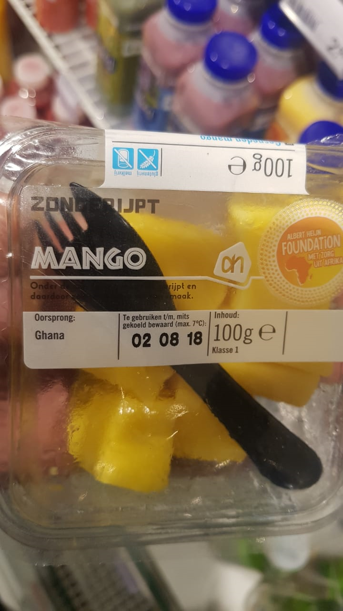
```
]


---
class: center, middle
### COMERCIALIZAÇÃO - IMPORTÂNCIA DO MARKETING

.pull-left[
```{r, echo=FALSE, out.width="75%"}
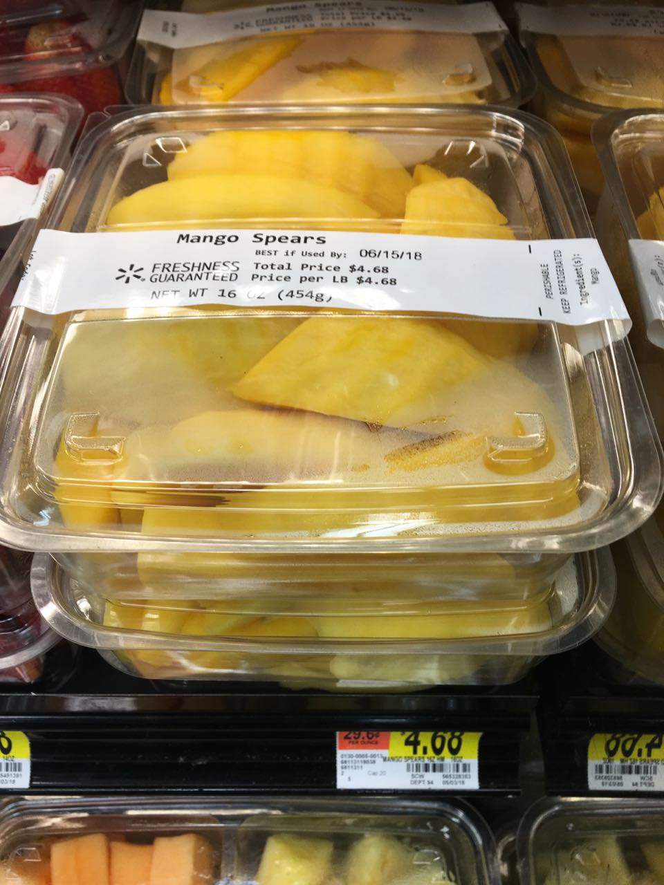
```
]


.pull-right[

- Um sistema de informações sobre o que mais se vendeu, por variedade, por semana, por mercado de destino. 

- Vivemos em uma sociedade em que predomina a escassez, seja de produtos ou de recursos financeiros. Por outro lado, as necessidades são infinitas apesar de reduzirem com o aumento das quantidades consumidas.

- Assim, o consumidor sempre terá algum tipo de necessidade para ser satisfeita e irá atrás de saciar enquanto tiver recursos financeiros para isto.

- Em geral o consumidor final/família avalia as possibilidades e escolhe a melhor relação custo/beneficio. Depois da compra vem a avaliação que pode ser desde muito positiva até bastante negativa.

]

---
class: center, middle
### COMERCIALIZAÇÃO - IMPORTÂNCIA DO MARKETING

.pull-left[
```{r, echo=FALSE, out.width="75%"}
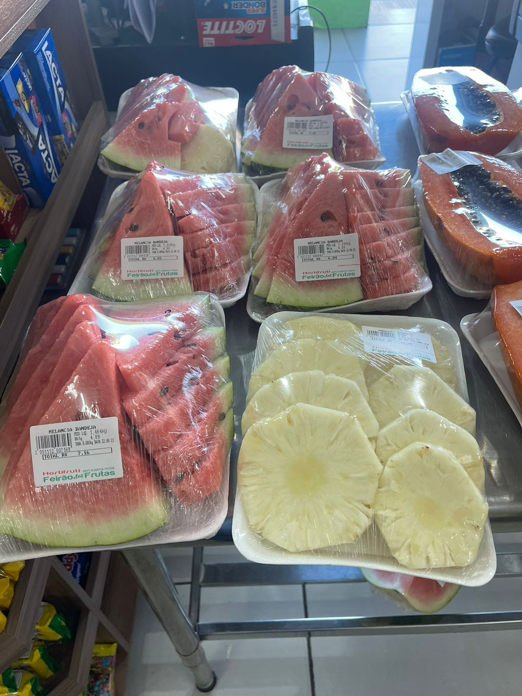
```
]

.pull-right[
```{r, echo=FALSE, out.width="75%"}
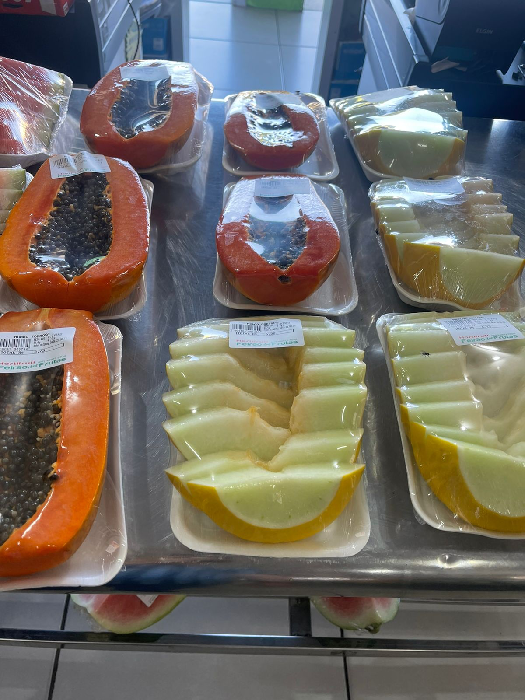
```
]

---
class: center, middle
### COMERCIALIZAÇÃO - IMPORTÂNCIA DO MARKETING

.pull-left[

- **Segmentar o mercado** pois os consumidores tem suas diferenças.

- A segmentação do mercado pode ocorrer via características geográficas, demográficas, psicográficas e comportamentais.

- Definidos os segmentos de mercado, o próximo passo é trabalhar para **tornar o seu produto visto como diferenciado em relação ao dos concorrentes**. Para isto, o produto pode ter uma aparência mais bonita, mais qualidade, mais sabor, serviço oferecido junto com o produto e a Marca, ou seja, o símbolo da empresa no mercado (tomar cuidado na hora das escolhas). 

- Exemplo mais atual é a Coopexvale instalando freezers nas frutarias.

]

.pull-right[

- Um Serviço de Atendimento ao Consumidor (SAC)

```{r, echo=FALSE, out.width="100%"}
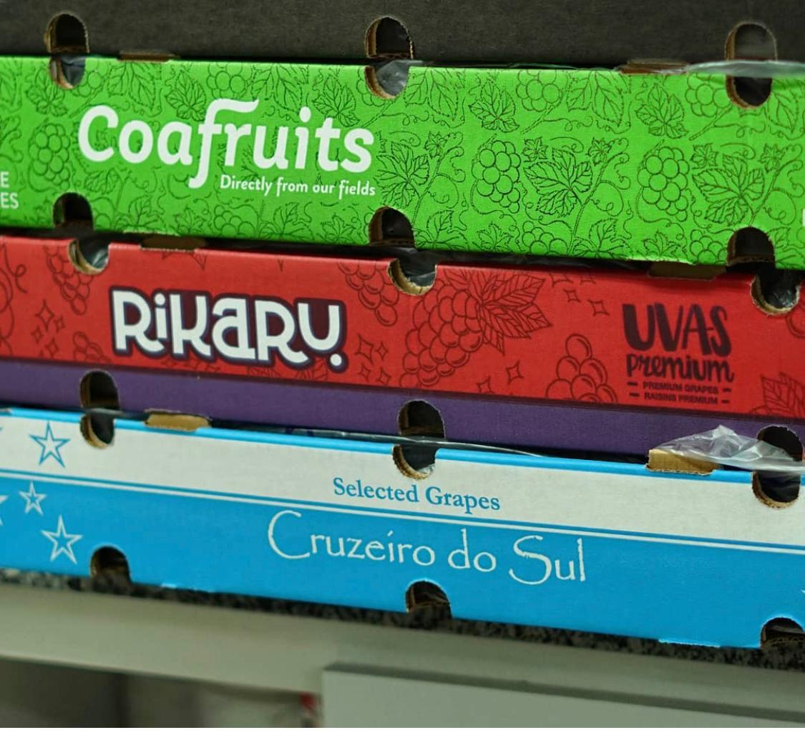
```

]

---
class: center, middle
### MARKETING

```{r, echo=FALSE, out.width="65%"}
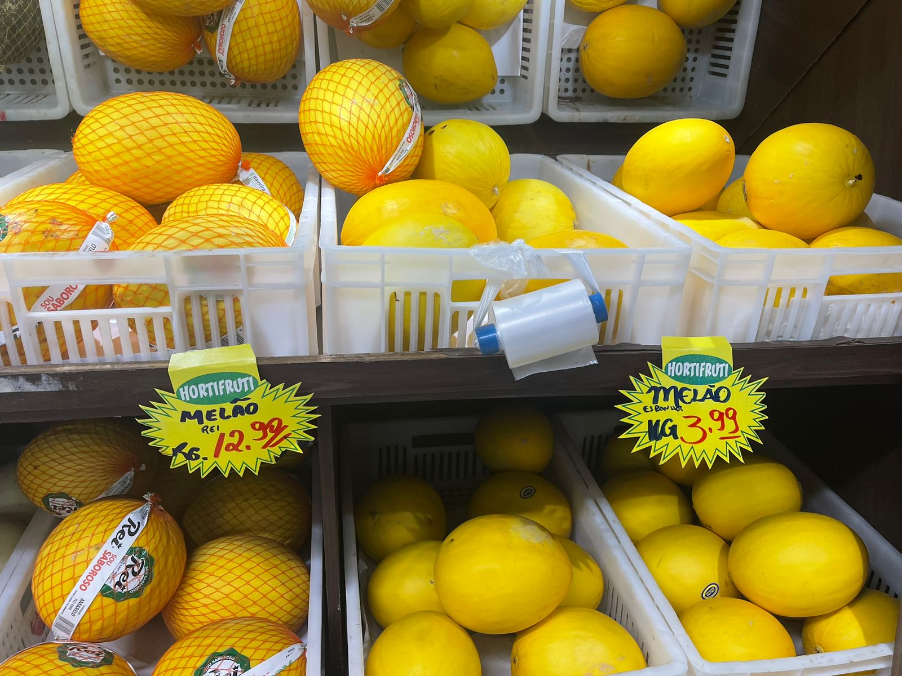
```

---
class: center, middle
### COMERCIALIZAÇÃO - IMPORTÂNCIA DO MARKETING

.pull-left[

- Marcas devem ser fáceis de pronunciar (Omo, Apple), ou elas podem ter relação com uma qualidade (Delícia, Sadia, Limpol), não ser confundível ou ter duplo-sentido.

- 	O marketing precisa transformar necessidade em desejo das pessoas que demandam o produto. 

- Os produtos possuem um ciclo de vida: são lançados, tem um período de crescimento, maturidade e depois entram em declínio.

- Contudo, existem produtos que conseguem ser líderes por muito tempo e outros que são lançados e logo em seguida abandonados.

]

.pull-right[

- E assim as empresas acabam tendo que sempre ir lançando novos produtos. Antes de ir efetivamente para o mercado, é importante que testes sejam realizados.

- Embalagem é algo importante também. Uma embalagem bonita normalmente está relacionado com um produto de qualidade.

- Embalagens inovadoras sempre aparecem no mercado.

- Uma parte fundamental é comunicar o consumidor que o produto está disponível.

]

---
class: center, middle
### COMERCIALIZAÇÃO - IMPORTÂNCIA DO MARKETING

.pull-left[

- Durante o dia as pessoas passam por uma grande quantidade de marcas, mas poucas são notadas ou geram alguma reação.

- Os consumidores guardam uma parte muito pequena do que vêem. 

- Assim, a comunicação precisa de um planejamento: I) identificar o mercado-alvo; II) determinar os objetivos da comunicação;

- III) Definir a mensagem (despertar atenção, desenvolver interesse, estimular o desejo e levar à ação); IV) Selecionar os canais de comunicação (rede social é muito forte atualmente); V) orçamento; VI) medir o efeito da comunicação; VII) fazer a gestão da comunicação.
 
]

.pull-right[

- Estabelecer a estratégia de preços: iguais, maiores ou menores do que a concorrência? Qual a elasticidade preço da demanda? É possível discriminar preços? Entender os seus custos de produção; Definir o preço final se for possível. Não é possível quando se é tomador de preço. 

- Distribuição adequada do produto. O seu canal de distribuição pode fazer a diferença para o sucesso no mercado. 

]

---
class: center, middle
### MARKETING

```{r, echo=FALSE, out.width="80%"}
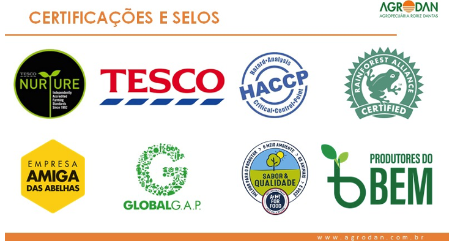
```

---
class: center, middle
### COMERCIALIZAÇÃO - SUSTENTABILIDADE

.pull-left[
```{r, echo=FALSE, out.width="80%"}
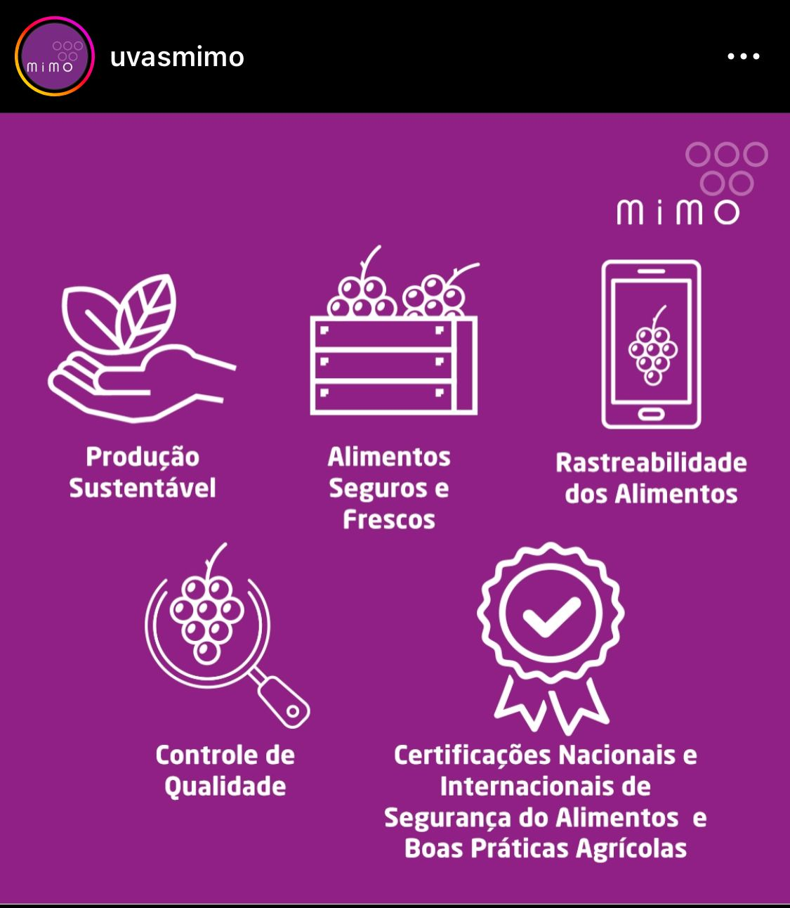
```
]

.pull-right[
```{r, echo=FALSE, out.width="70%"}
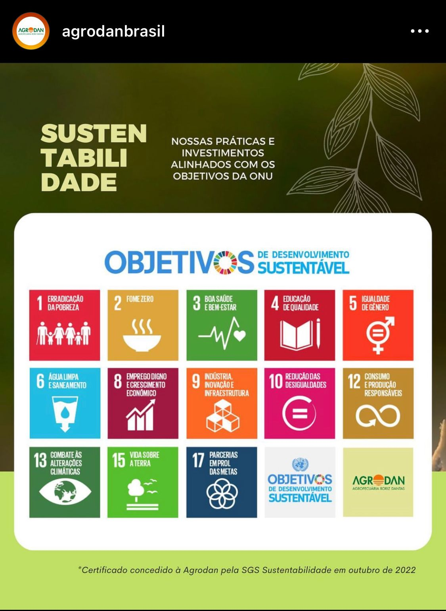
```
]

---
class: center
### PRODUTOS ORGÂNICOS

.pull-left[

-  Evolução das atividades agropecuárias pautada não apenas no aumento da produtividade, mas incluindo-se a proteção e recuperação do meio ambiente, visando prover a demanda de alimentos de forma sustentável.

- O Consumidor tende para buscar este tipo de produto (qualidade), dado que já tem condições suficientes de comprar seus alimentos (quantidade).

- O consumo de produtos orgânicos tem sido impulsionado pela tendência mundial de procura por alimentos que proporcionem saúde e bem-estar (DIAS et al., 2015).

]

.pull-right[

- Entendem a importância do uso de insumos biológicos para as culturas, que são menos ofensivos ao meio ambiente;

- A produção e o consumo de produtos orgânicos vêm apresentando um alto crescimento;

- Os produtores orgânicos brasileiros dividem-se basicamente em dois grupos: o dos pequenos produtores familiares ligados às associações, representando 90% do total de agricultores e sendo responsáveis por cerca de 70% da produção orgânica brasileira e o grupo que compreende os grandes produtores empresariais (10%), ligados a empresas privadas. 

]

---
class: center
### PRODUTOS ORGÂNICOS

.pull-left[

- Quando se trata de competitividade, a agricultura orgânica em geral é menos competitiva, pois os custos de produção são bem maiores, e o nível de produtividade é menor em relação a agricultura convencional. 

- Isso faz com que os preços dos alimentos do convencional sejam bem menores e mais atrativos dos que os preços do orgânico, para uma grande parcela da população. 

- Os alimentos cultivados sob o sistema em que adotam tecnologias que otimizem o uso de recursos naturais e socioeconômicos, respeitando a integridade cultural e tendo por objetivo a sua autossustentação no tempo e no espaço podem receber o selo federal oficial do SisOrg, após passarem por um processo de certificação.

]

.pull-right[

- A certificação é, então, uma garantia de que produtos que possuem o selo oficial de orgânico tenham sido produzidos dentro dos padrões da agricultura orgânica, ajudando a eliminar, ou ao menos reduzir, a incerteza quanto à qualidade dos produtos.

- O desenvolvimento do mercado de produtos orgânicos depende fundamentalmente da confiança dos consumidores na sua autenticidade que, por sua vez, só pode ser assegurada por legislação e/ou programas de certificação eficientes. 

- Entre as dificuldades que a agricultura orgânica enfrenta, pode-se citar: descapitalização, alta competitividade da produção convencional, baixa escolaridade dos produtores. 

]

---
class: center
### COOPERATIVISMO

.pull-left[

- O cooperativismo representa uma nova forma de organização econômica, de mercado e de trabalho, baseados na cooperação. O ingresso dos produtores em cooperativa é importante pois a cooperativa localiza-se em uma estrutura intermediária entre duas economias, de um lado os interesses do produtor e do outro, o mercado.

- As cooperativas podem atuar como organizadoras dos produtores, das agroindústrias da produção, da comercialização de insumos e produtos, etc.

-  No século XX o pensamento enfoca a cooperativa como forma societária e econômica, participante do mercado em condições de competitividade, mas conservando sua essência de sociedade participativa, democrática e social;

]

.pull-right[

```{r, echo=FALSE, out.width="100%"}

```

]

---
class: center
### COOPERATIVISMO

.pull-left[

- Na prática, as cooperativas modernizadas deixam as preocupações utópicas e passam a buscar suprir os interesses individuais dos cooperados (não priorizando o indivíduo em detrimento do coletivo), assim como tornar a cooperativa uma empresa econômica eficaz, com condições de competir nos mercados concorrentes;

- Os pressupostos da teoria podem ser resumidos nos seguintes aspectos: a cooperação não exclui o interesse pessoal nem a concorrência; o associado busca satisfazer seu interesse individual através da cooperação, quando constata que a ação isolada lhe é desfavorável; a cooperativa desenvolve atividades econômicas complementares às unidades produtivas de seus sócios; a lealdade de grupo resulta de contrato em que estão definidas as bases do relacionamento econômico. 

]

.pull-right[

- Na cooperativa existem complexidades maiores que as existentes nas empresas de capital, em razão do seu cunho democrático. Em virtude disso, se torna oportuno que a administração da cooperativa seja conduzida por profissionais técnicos, podendo ser recrutado internamente, se disponível, ou no mercado. Essa consciência é considerada como primeiro passo em direção da separação entre propriedade e controle. 

- No  Brasil, a partir de 1906 surgiram as primeiras cooperativas agropecuárias, criadas por produtores rurais e imigrantes, principalmente da Alemanha e Itália. A primeira cooperativa agropecuária brasileira foi constituída na região Sul do país, mais precisamente no estado do Paraná. 

]

---
class: center
### COOPERATIVISMO

.pull-left[

- Atualmente existem 13 ramos de setores econômicos de cooperativismo, sendo a agropecuária o maior deles, desde a produção de produtos rurais até a agroindústria.

- O Censo Agropecuário de 2017 registrou 579,5 mil estabelecimentos ligados a cooperativas, o equivalente a 11,4% do total de estabelecimentos agropecuários do Brasil, e um aumento de 67,3% em relação ao censo de 2006;

-  A maior concentração de estabelecimentos está localizada na região Sul. Outro dado que sobressai é sobre a área dos estabelecimentos destinada às cooperativas que são cerca de 70,5 milhões de hectares. Desse total, as maiores participações são das áreas entre 1 e 50 hectares (70,6%), ou seja, dos pequenos e médios produtores (IBGE, 2017). 

]

.pull-right[

- Distribuição da proporção de cooperados por UF, com base em Alves Lima (2021).

```{r, echo=FALSE, out.width="110%"}
knitr::include_graphics("img_r/cooperativa3.png")
```

]

---
class: center
### COOPERATIVISMO

.pull-left[

- Para Rodrigues (2008), as cooperativas agropecuárias brasileiras cumprem o papel de melhorar a renda dos produtores, considerando que isolados não conseguem negociar os preços dos insumos de produção ou barganhar no momento da venda de sua produção a atravessadores ou agroindústrias;

- As cooperativas compram e vendem em volume e constância, com isso conseguem melhorar a renda final dos cooperados. Quando operam de forma verticalizada, agregam ainda mais valor ao produto através do beneficiamento (industrialização) ou distribuição por conta própria.

]

.pull-right[

- Na realidade das cooperativas, os desafios se ampliam principalmente no que diz respeito à separação da propriedade e do controle (gestão profissionalizada).

- Problemas referentes ao pressuposto do oportunismo de agentes existem. Entre eles, o duplo papel do cooperado na organização, ou seja, além de ser funcionário também é proprietário dos recursos produtivos.

- O oportunismo de agentes gera custos de controle. Assim, entre os aspectos que enfraquecem uma estrutura organizacional, está a má governança.

]

---
class: center, middle
### COOPERATIVISMO

```{r, echo=FALSE, out.width="90%"}
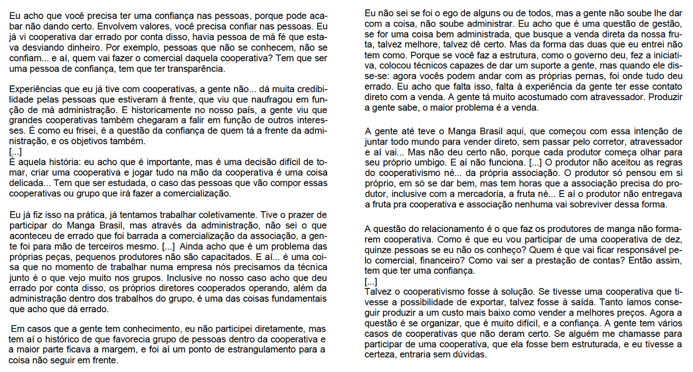
```


---
class: center, middle

#OBRIGADO!

João Ricardo F. de Lima <br>
Email: joao.ricardo@embrapa.br


https://www.embrapa.br/observatorio-da-manga <br>
https://www.embrapa.br/observatorio-da-uva


Telefones:<br>
87-3866-3667  
87-99961-5799 
